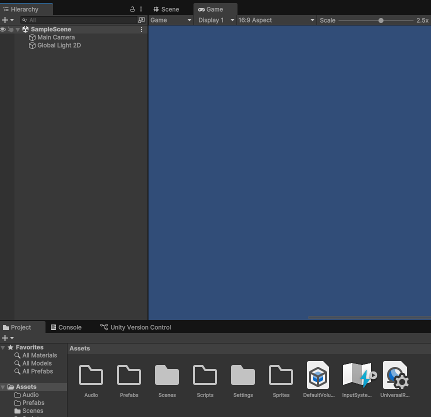

# Project Setup

* Create a new project using the _Universal 2D_ template.
* Give it a name of _Platformer_ or something similar
* Set the game to have a 16:9 aspect ratio
* Add the following folders to your project:
  * Prefabs
  * Audio
  * Sprites
  * Scripts

---
>Prev: [Contents](..%2FREADME.md) | Next: [Create the Player](/02_Player/PLAYER.md)
