# Basic Player Setup

## Make Some Ground
* Create a 2D Square sprite.
* Rename it to Ground
* Stretch it to cover the bottom of the screen area.
  * This doesn't have to be perfect. We're just using it for testing.
* Add a BoxCollider2D component

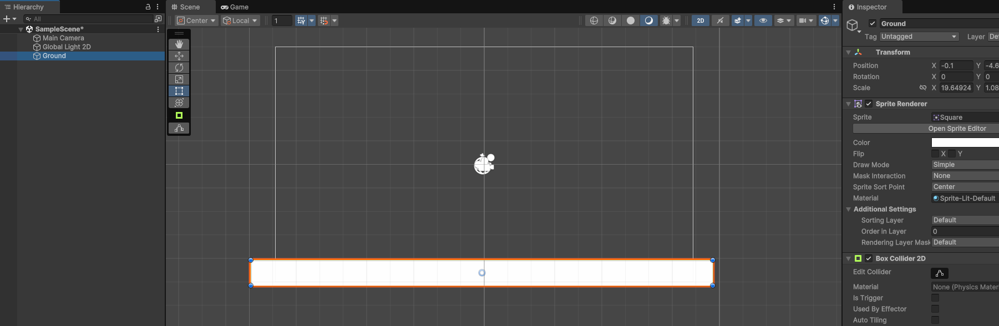

## Make Some Player
* Create another 2D Square sprite.
* Rename it to Player
* Scale it so it's a little taller than it is wide.
* Add a BoxCollider2D and RidgidBody2D component.

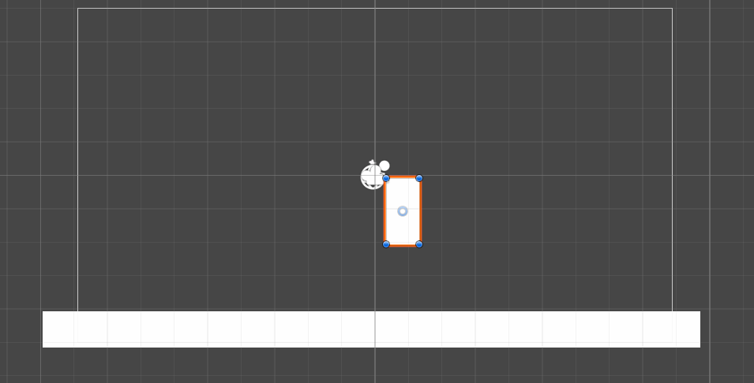

* Create a new script named Player in the Scripts folder
* Add it to the Player object
* Open the script

## Player Script

Create some globals to handle player movement:

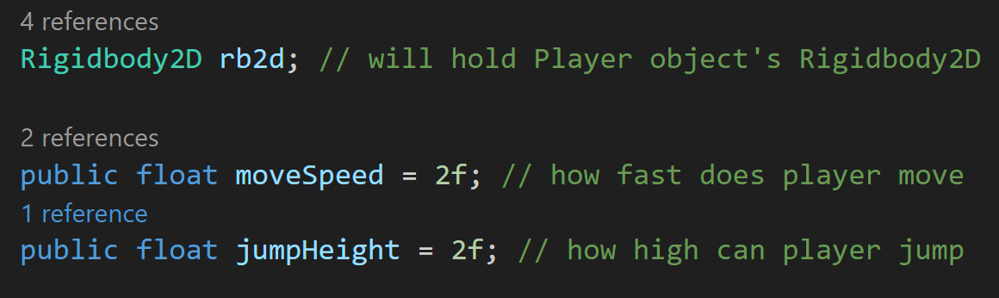

In Start(), set rb2d to be equal to the RidgidBody2D attached to the object using this script (the player):

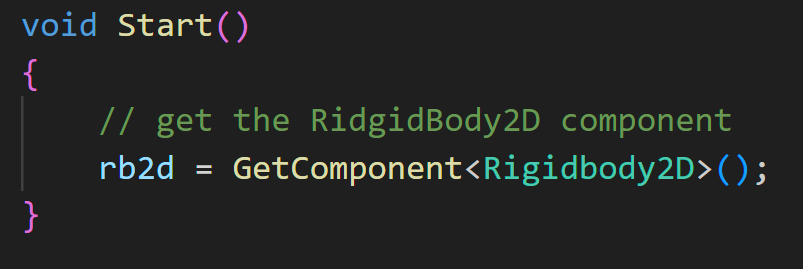

I want to get input from the player, but I don't want to visually crowd Update(). To help with this, I'm going to 
create a player input function, and then call it from Update().

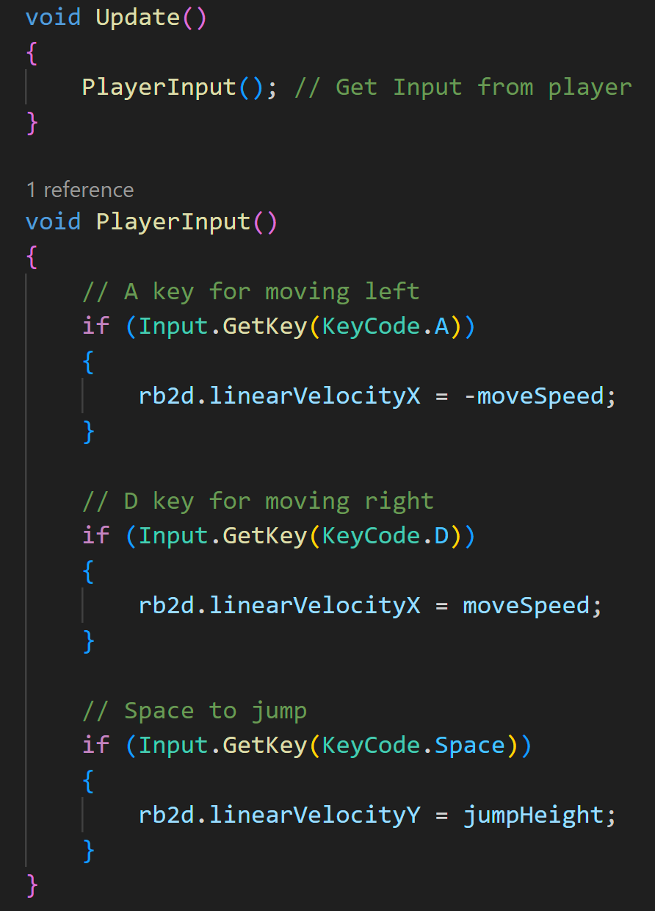

Now that we have some basic inputs, we can test it out.

It works okay, but you'll notice that if you hold down the space-bar, the player basically flies upward until you let it go.
That could be an interesting mechanic, but for now, we want more of a classic jump and fall. 

>[!TIP]
> Let's think about the order of actions (or the rules) we need to achieve the action we want:
> * The character is on the ground
> * The player presses the space key to jump
> * The character should move upwards to a specific height
> * The character should fall downward by gravity
> * The character is unable to jump until after it makes contact with the ground again.

So we need to know:
1. What is the ground? 
   * Since this is a platformer, we don't want to just apply this to a Ground object. We want this to be applied to any object that the player could possibly stand on and jump from.
2. We want to know if the player is currently jumping or not.
   * If the player is already jumping, we don't want to continue jumping. That's basically what we have already.
3. We need to know if the character is touching ground or not.
   * The character can only jump off of ground and has its ability to jump reset after falling back to ground.

The first thing we want to do is create a tag named "Ground" and apply it to the Ground object that we're currently using for testing.

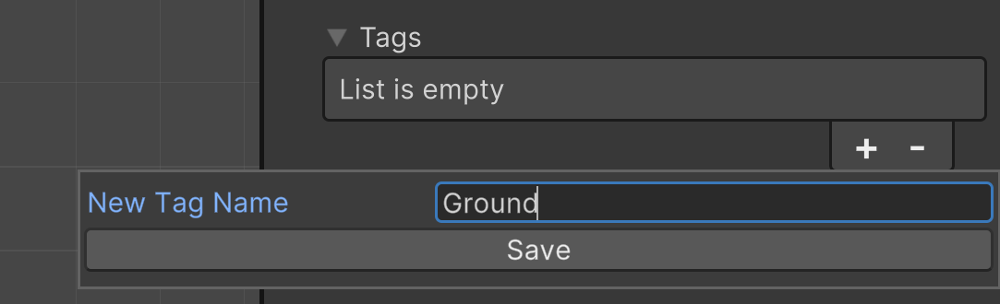

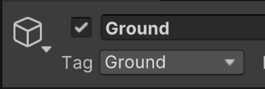

Now back in out Player script, let's make some global booleans to help keep track of the player's state:

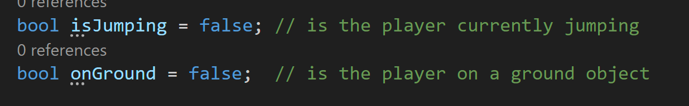

Now we need to check if the player is on Ground. Previously we've used the OnTriggerEnter2D function, but now we want to 
check for objects that have colliders but aren't triggers. Remember if the ground collider was set to be a trigger, the player would
fall through. So instead we'll do this:

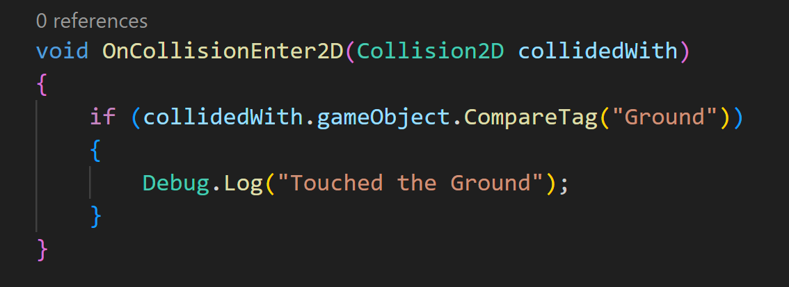

You see that we're still looking for the tag of "Ground", and if we collide with an object that has that tag, let's write a debug message.

Save and test it out. You should see the debug message printed each time the player touches the ground:

Now that we know it works, let's make it so that every time the player collides with a ground object, we set onGround to true:

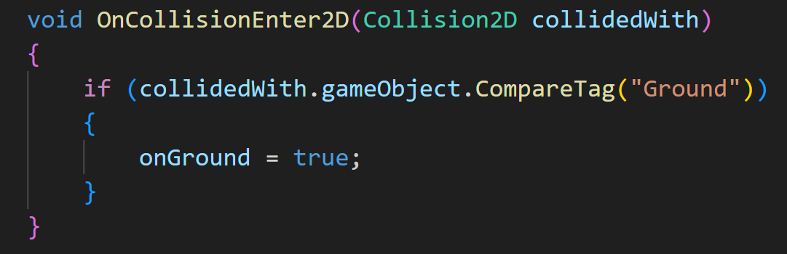

Now we can modify the jumping logic:

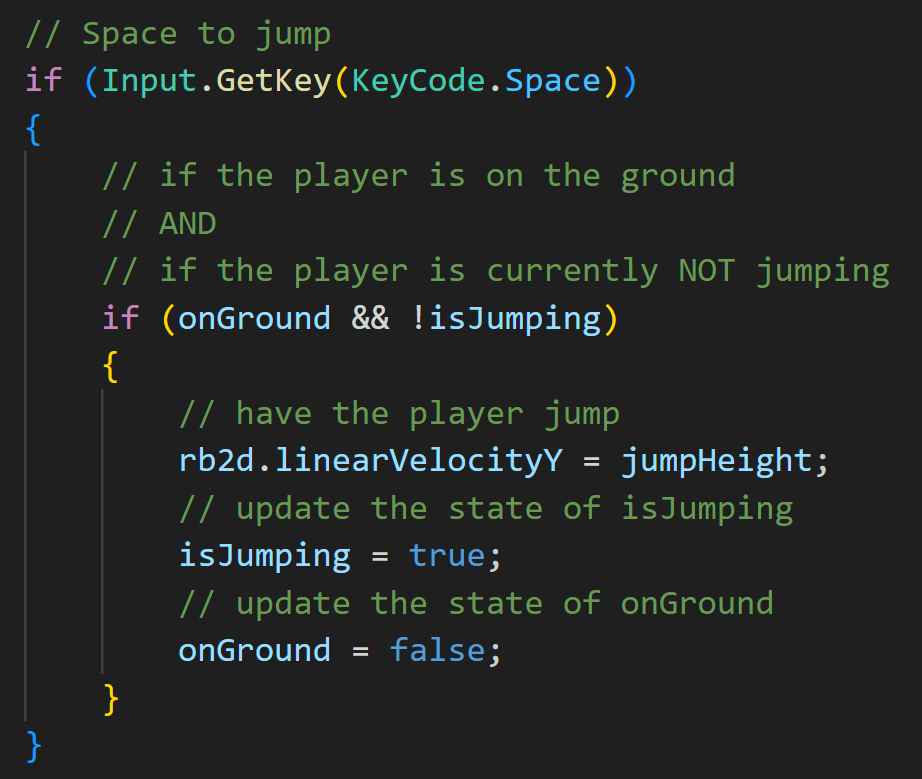

Since part of our jumping mechanic deals with if the player has yet to jump, we need to also add a line of logic when we're
detecting if the player is on ground:

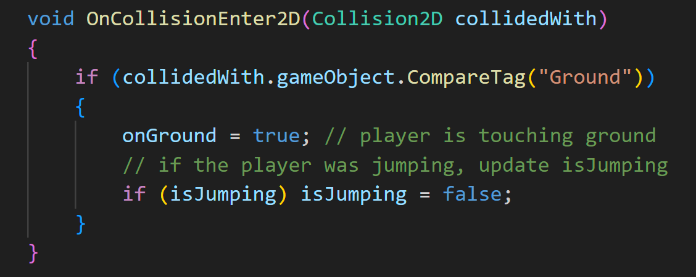

Let's test it out and see how it goes:

It works! Mostly.... Our jump is more of a hop (we can just increase jumpHeight), but the test does remind us to freeze Z rotation on the player's
RidgidBody2D component:

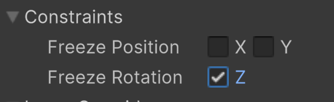

### Test Platforms
Let's add some more platforms so we can dial in the jumping a little more.

* Create an empty object and name it "Platforms"
* Place the Ground object inside
* Duplicate the Ground object a couple of times, scale and place them.

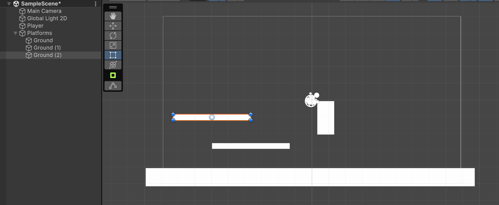

This doesn't have to be perfect. It's just for some quick testing.

Increase the value of jumpHeight. I first tried 5, but found that it wasn't high enough. It did lead me to discover a 
bug in my jumping logic. If I hold the direction towards of a ground object, the character can
"stick" to the edge of the platform. Again, this could be an interesting game mechanic, but it's not what I want for the
project right now.

>[!NOTE]
> Below is not a .gif that lasts forever. It's just an image. Just FYI.

This is happening because of the "friction" of the ground and player while the player is constantly applying positive velocity
towards the platform. To modify the friction, we can create a new Physics 2D Material.

* Create a folder named Physics Materials
* Create a new 2D Physics Material
* Copy each setting below

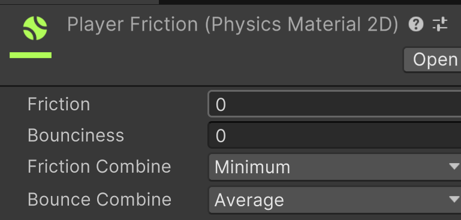

Now apply the material to the BoxCollider2D on the player.

If you test it out, you see that it solves the problem of the player sticking, but it creates a new one where it's like
the player is gliding across ice.

A way that we can handle the situation is to give the player a ground detection system that only applies to the bottom of the character.

* Add an empty object to the Player object, and name it "Feet".
* Add a BoxCollider2D to Feet
* Scale and place the collider so that it sits at the bottom

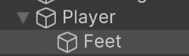

In the image below, the green outline is my Feet collider, and the black outline is the player sprite ( this is in wireframe view
so that you can better see the collider):

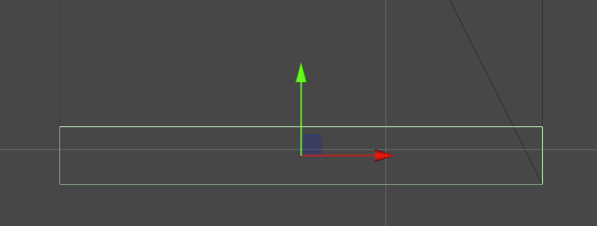

Now we can adjust the Y offset and height of the box collider on the player object:

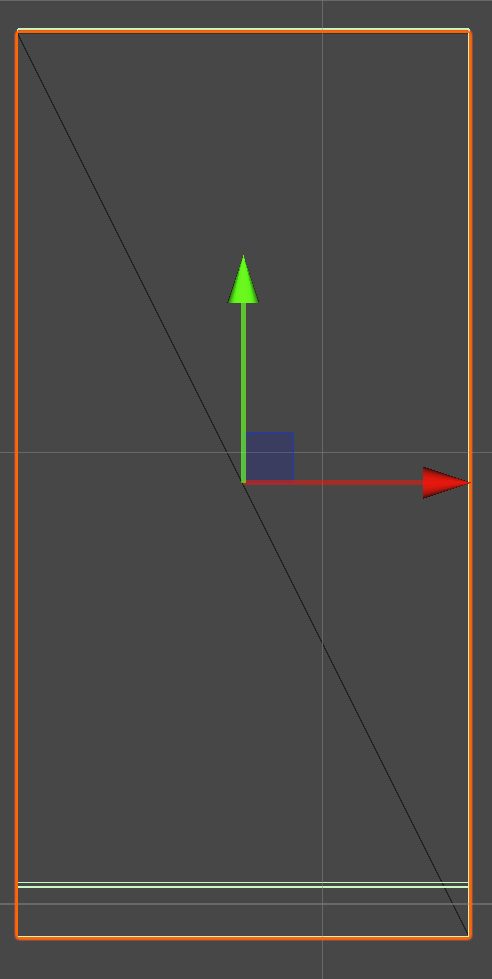

The red outline is the player object. Where the two green lines are close at the bottom, the upper one is the bottom of the original
box collider.

This makes it so that only the upper collider that surrounds the majority of the body has the frictionless physics material applied to it, but
the "Feet" of the player will act as normal.

Let's test it:

It's really close, but we're getting a weird extra jump in there. That's because our Player box collider is also part of the check for colliding with
ground. We want to make it so that only the feet are checking for ground and letting the player object know the results.

* Create a new script named PlayerFeet
* Add it to the Feet object.
* Open the script.

We're going to move the collision logic from the player script. This is the entire script:

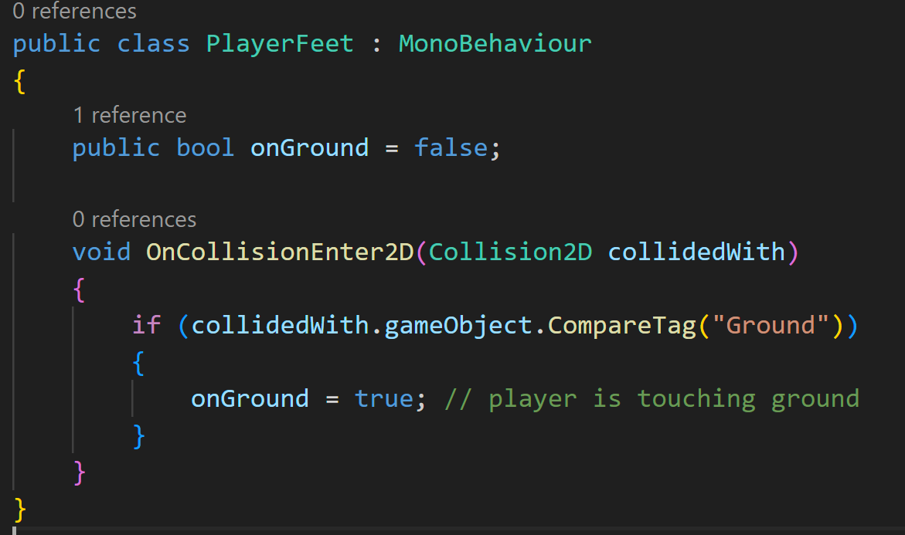

In the player script, remove the boolean onGround and replace it with a reference to the feet object:

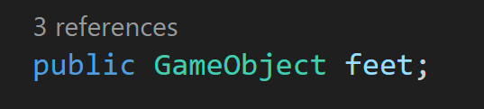

Now in PlayerInput(), we'll replace onGround with the reference to the Feet component's onGround. Additionally, add
another if-statement to reset the state of jumping, and comment out or delete the OnCollisionEnter2D function:

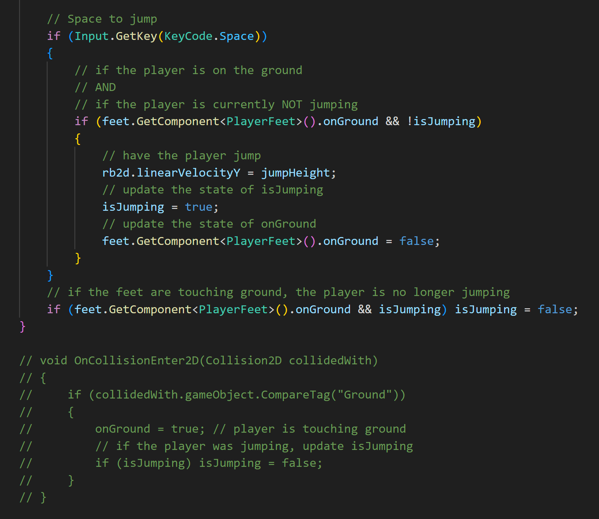

Back in Unity, assign the reference to the Feet object in the Player.
If you try the game out now, it should feel closer to what you expect from a traditional platformer.

---
>Prev: [Project Setup](/01_Setup/SETUP.md) | Next: [Adding Sprites](/03_Sprites/SPRITES.md)
