# Adding Sprites
---
So far we've only used Unity's builtin sprites, 2D images. This is how you want to start developing a game, making sure
the game is fun to play before investing into any artwork, but obviously, that's not that fun to look at. We're going
to make use of a sprite asset pack that's been made available for free.

We're going to look at a few different ways sprite assets can be formatted to use in a game.

## Single Sprite Image
___
Typically when making sprites, you want them to be in a .PNG format. This is so you can have an invisible background rather
than a white one. It's also good practice to author your files in a vector format first, so that they can scale to any resolution,
and then convert them to a .png file.

I want to keep my sprites organized, so I'm going to add a Player and Backgrounds folder inside the Sprites folder.

### Player Sprite

Looking through the sprites, I see one that's a ghost that looks kind of fun. It's meant to be an enemy, but it gives me
an idea for a game that I want to run with. So I'm going to drag and drop all the related ghost .png files into the 
Sprites > Player folder.

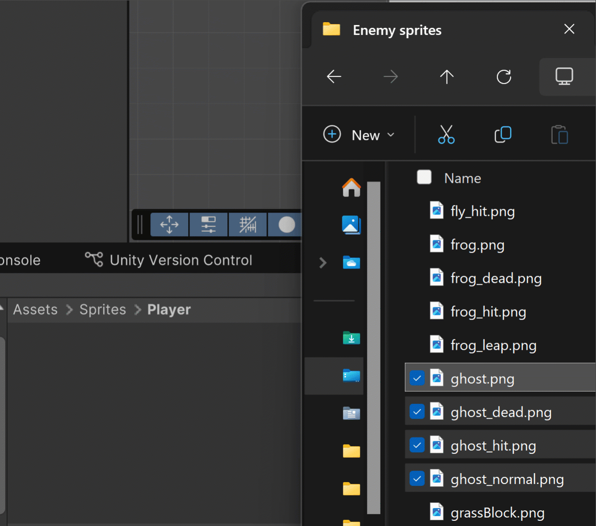

Now I'm going to select the Player object, and assign the ghost_normal file to be its sprite in the Sprite Renderer component.

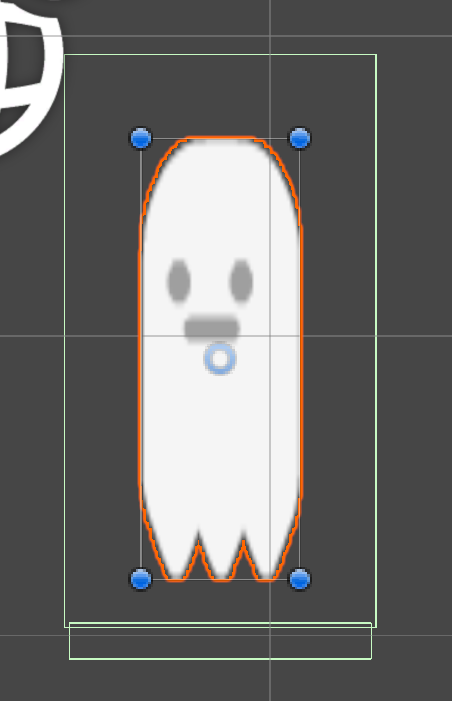

You can see the sizing is a little off, so I'm going to change the Player object's scale back to 1, 1, 1.

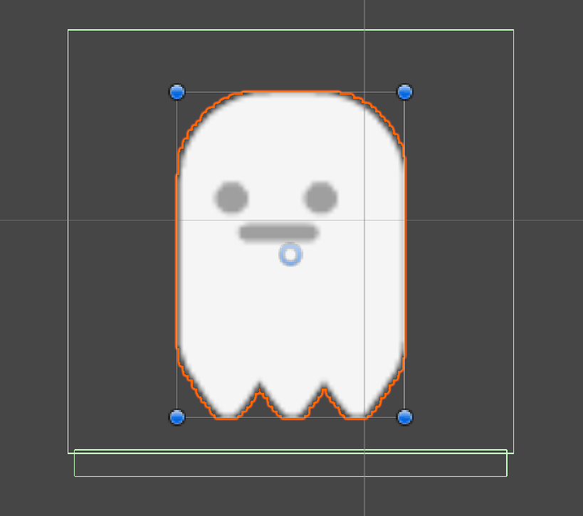

The sprite looks better, but the colliders are too wide and too tall. Let's adjust them to better fit the sprite:

After some fiddling with the player and feet colliders, I got this:

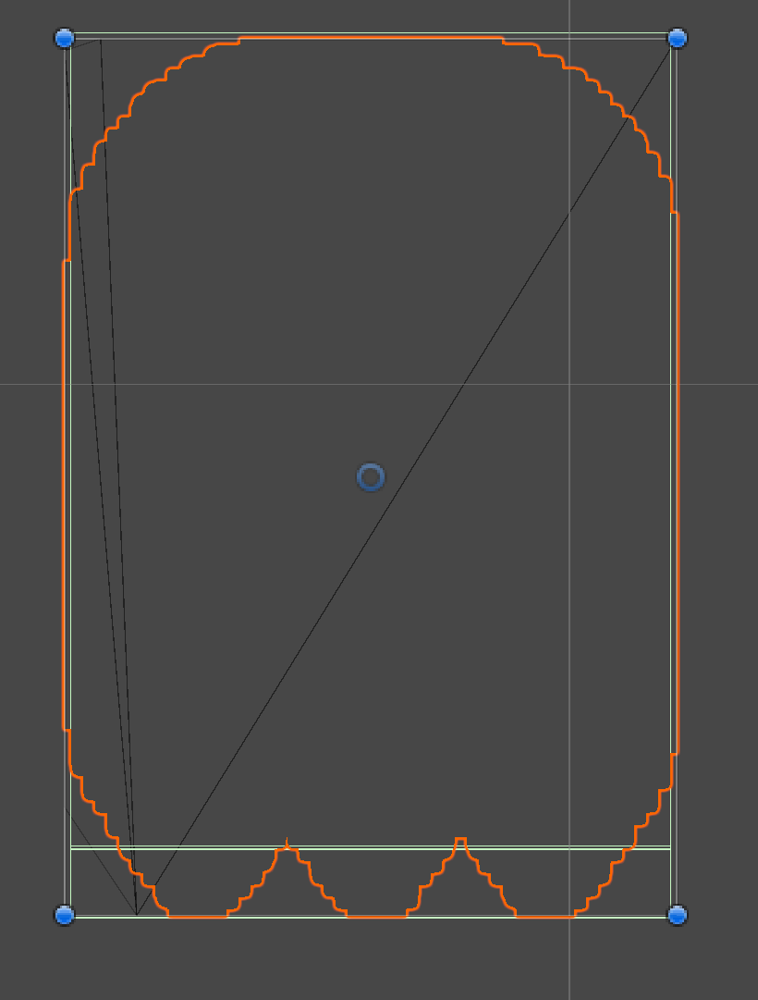

If you're curious about the values I wound up with,

Player collider:

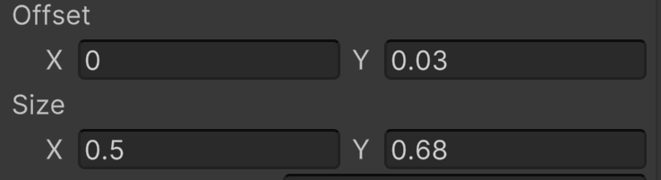

Feet collider:

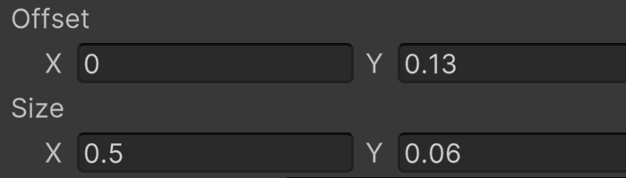

Now you can test it out:

Pretty easy, yeah? You'll probably notice that the ghost only looks in one direction. That's okay we can change that
through some additions to the Player script.

First let's create a variable to access the player's sprite renderer:

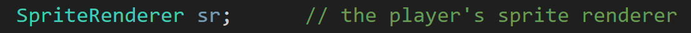

Then in Start(), let's get the sprite renderer attached to the player:

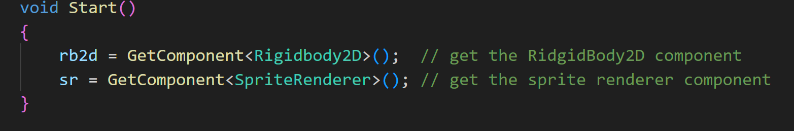

Now in PlayerInput(), we want the sprite to look left when the 'A' key is pressed and right when 'D' is pressed. 
We can do this by flipping the sprite ( or mirroring it ) across the x-axis. 
By default, the sprite is already looking left, so the input code looks like this:

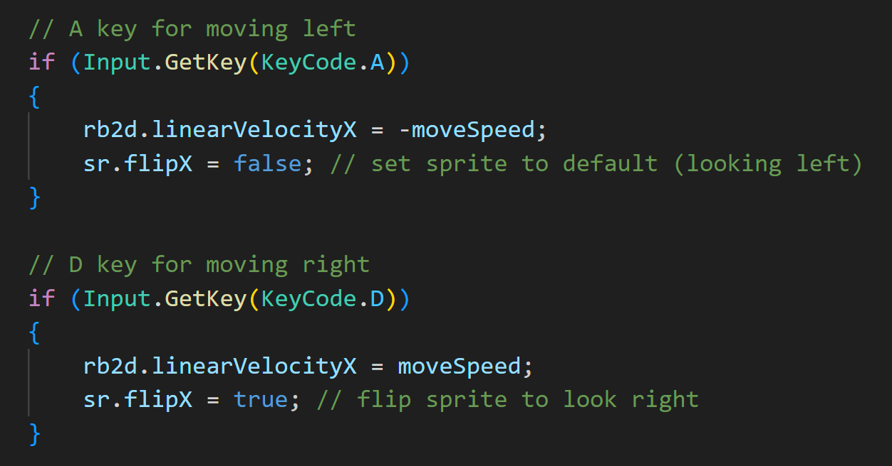

### Environment Sprites

Since I have an idea where I want to go with my game, I want to update my folder organization. I'm going to create a 
new folder in Sprites named Graveyard, and then I move the Backgrounds folder inside that folder:

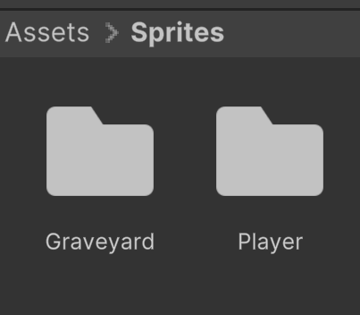

In the graveyard folder I'm going to add in a sprite that I want to use as the base ground. In the asset pack it was 
named Tile(2), but I'm going to change the name to GroundTile to know what it's for.

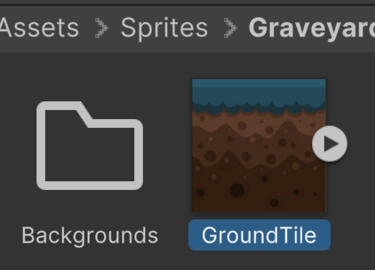

You see that if I add GroundTile as the sprite for the ground, it looks stretched out:

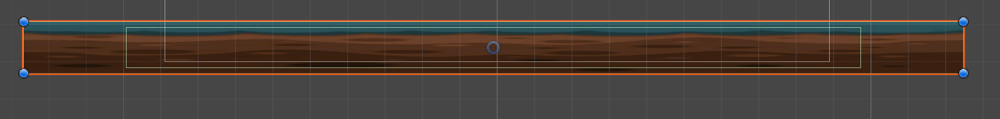

If you look at the draw mode option in the sprite renderer, you can see it's set to simple. I want this to be tiled ( repeated )
so that it doesn't look bad. If we change the draw mode to tiled, you'll see a warning:

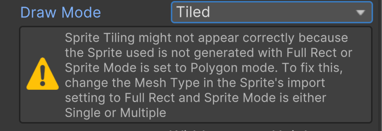

Let's take a look at GroundTile's settings by clicking on it in the project folder and seeing what the Inspector panel has in it:

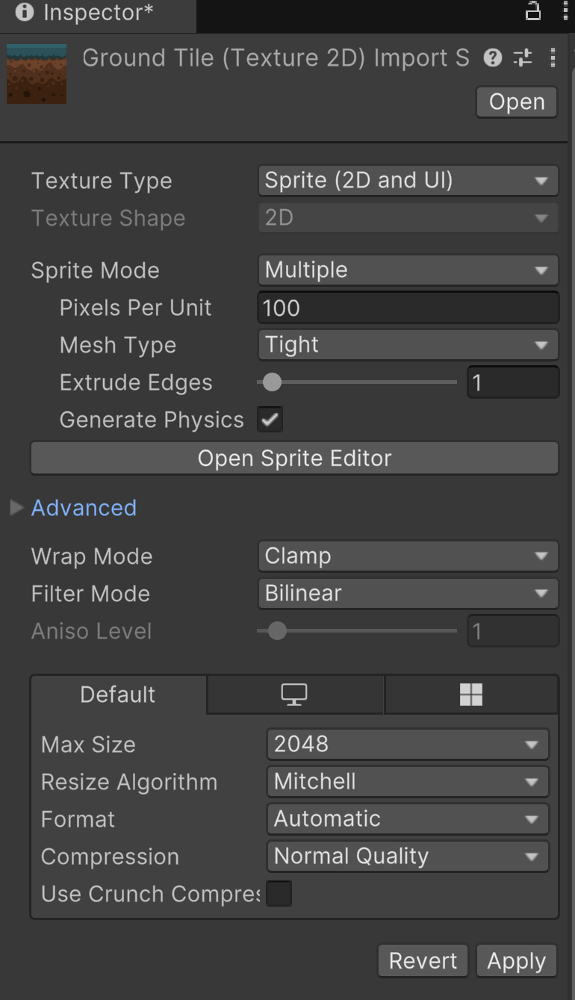

So there's a decent amount going on, but we need to understand some of it to get the sprites looking like how we want. We didn't have to do 
this with the ghost sprite because we just wanted to display it normally. If you want a sprite to not be stretched out, we want to look at these settings:

>[!TIP]
> You can find better and more detailed explanations of these settings in [Unity's documentation](https://docs.unity3d.com/6000.0/Documentation/Manual/texture-type-sprite.html).

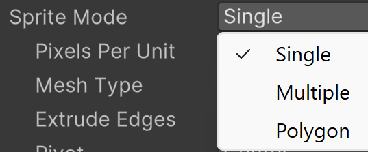

* Sprite Mode -  tells Unity if this is a single image sprite, a sprite sheet with multiple images ( we'll get to that later ), or a sprite that will be cut to the 
shape of a defined polygon. 
  * For this sprite that we want to tile, we want the value to be single.

* Pixels Per Unit - how many pixels equal one measured unit in Unity.
  * If you look at the scene view, by default one square is 1 Unity unit by 1 Unity unit 
    * 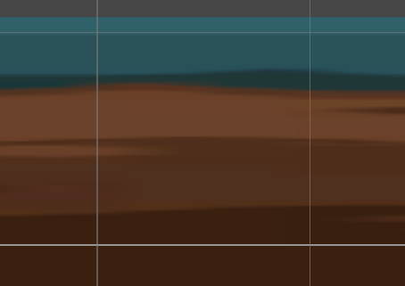
  * If you look at the bottom of the inspector for GroundTile, you can see that its pixel size is 128 x 128, so that's the value I'm going to put.
    * 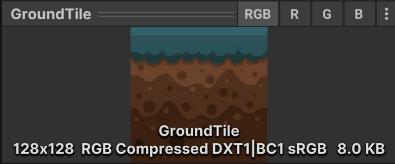

* Mesh Type - Unity generates a mesh to apply the sprite to. 
  * Tight keeps the mesh close to the artwork, and its borders are based on the image alpha values. 
  * Full Rect creates a 4 sided mesh.
    * Remember the warning earlier said that if we want to tile the sprite, we needed to change it to Full Rect.

* Wrap Mode - This controls how the sprite tiles.
  * By default, it's set to clamp, which stretches the sprite.
  * We want to change it to Repeat

So my settings for GroundTile end up like this:

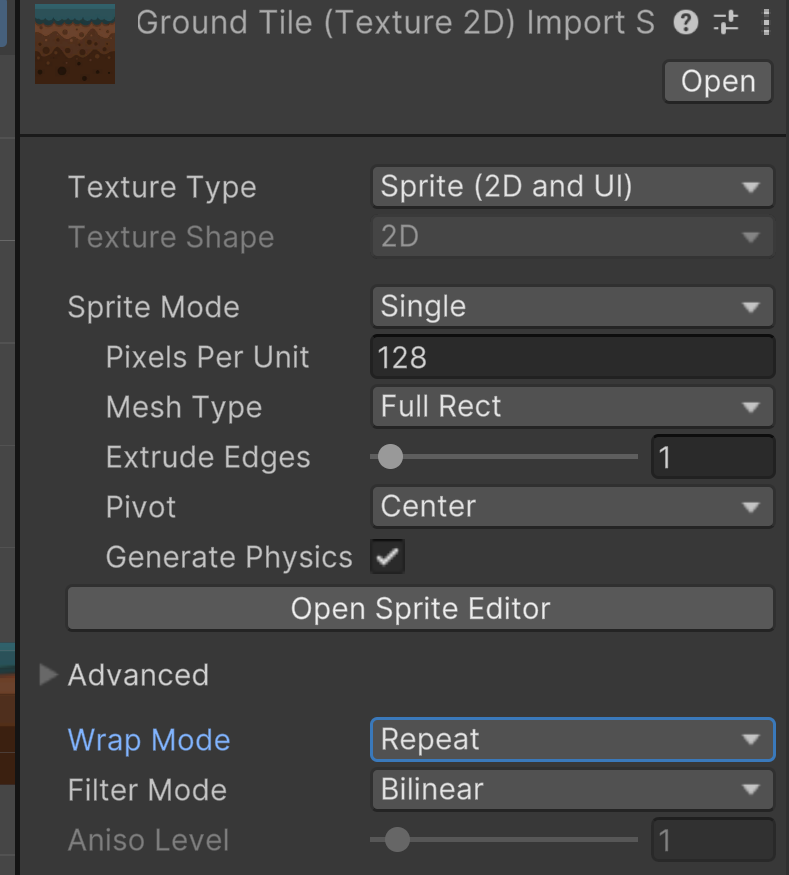

Now you can click the Apply button at the bottom to set the changes

Rather than trying to fix the ground object, let's delete it and make a new one.

Drag and drop the GroundTile into the scene:

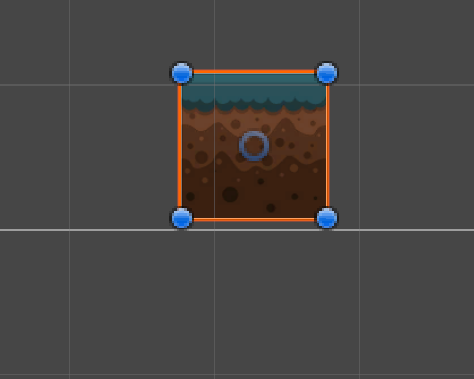

Scale it out like the original:

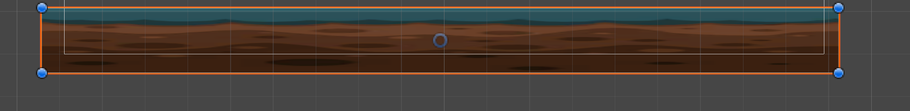

Notice it's all stretched out. We just need to make some adjustments in the Sprite Renderer:

Change Draw Mode to Tiled and Tile Mode to Adaptive:

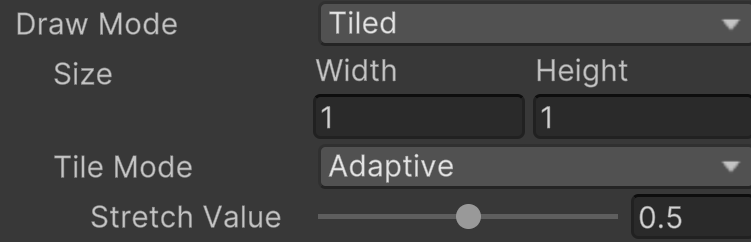

Still looks all stretched, huh? Change the scale back to 1, 1, 1. Now try scaling it again:

Notice now when you scale out the tile, the object's transform scale isn't changing, but the tiled size is. The width and
height are in game units. For Tile Mode, the Adaptive option gives you a little wiggle room and will stretch the sprite to an extent (the stretch value).
If you want it to be an exact 1:1, you can have it set to Continuous, so as soon as the height value goes over 1, you start seeing the sprite
tiling in the Y direction.

When adding tile-able sprites, this is the basic workflow to follow:

1. Change the import settings before adding to the scene.
2. After applied, add the sprite to the scene.
3. Change the Sprite Renderer's Draw Mode to Tiled
4. Add a BoxCollider2D if the player is meant to collide with it.
5. Add the Ground tag if it's meant to be treated as ground

After adding a box collider to the GroundTile, you may notice an issue:

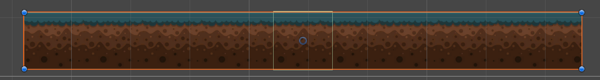

The collider doesn't fit the entire shape. If you change the colliders x and y size to match the sprite renderer's draw size of width and height, it matched perfectly.

But what if I decide I want the ground to be smaller or bigger?

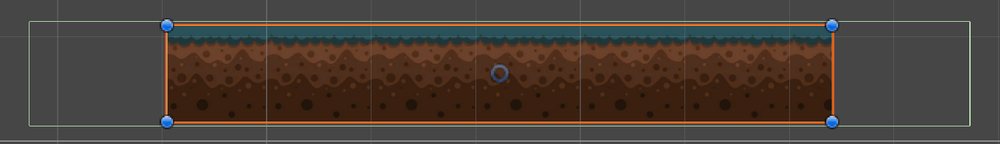

The collider no longer fits correctly. I don't want to have to resize the collider whenever I might change the size of the ground, so this makes
a good case to create a script to do it for us:

In the Scripts folder:
* Create a new script
* Name it TileCollider
* Add it to the GroundCollider object
* Open the script

We know what we want to achieve, and overall, it's pretty simple:

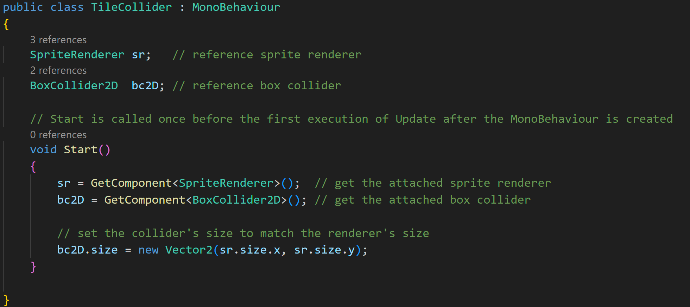

If you test it out by changing the size of the GroundTile and trying it each time, you can tell the script works.
But I don't like seeing the collider box not match the scale. I can imagine as the scene get more complicated, things
becoming a little confusing. Okay it's not that big of a deal, but let's use this as an excuse to make our first editor tool.

In the script, we're going to:
1. Change Start() to Update()
2. and add [ExecuteInEditMode] above the class definition

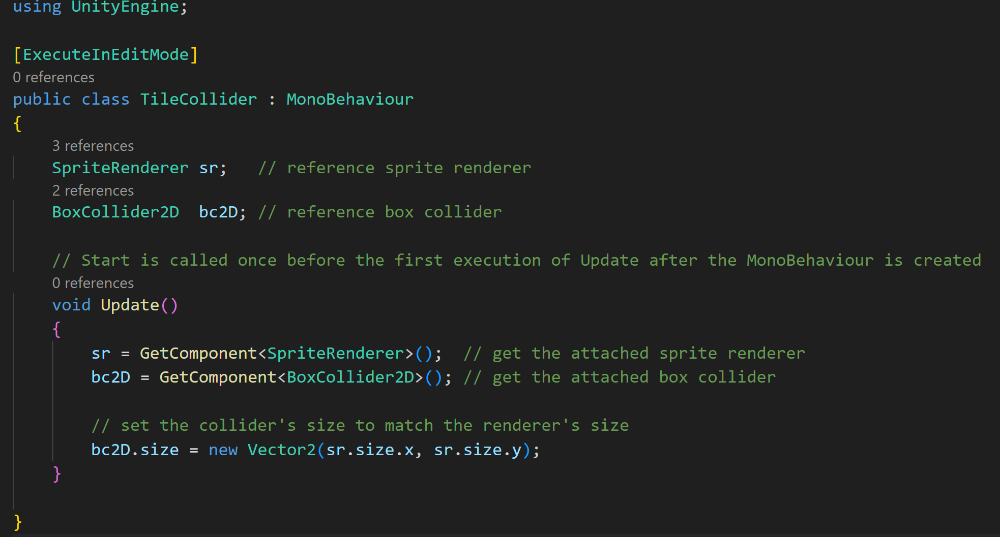

Now as we change the size of the ground in the editor, we can see the size of the box collider update as well:

When you add [ExecuteInEditMode] above the class definition, Unity will run the script while playing the game AND when
in the editor. Even though we changed the function to use Update(), the script isn't always running like it would during the game.
It will only run in the editor when something in the scene changes.

>[!NOTE]
> You can [dive into it more here](https://docs.unity3d.com/6000.0/Documentation/ScriptReference/ExecuteInEditMode.html) if you like.
> It explains how different event functions behave in the editor when using [ExecuteInEditMode].

Now that things are working how I like, I'm going to turn the GroundTile object into a prefab.

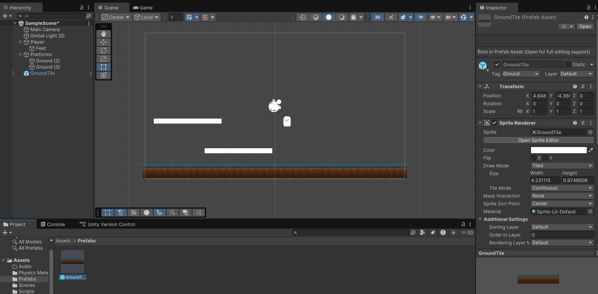

---
>Prev: [Create the Player](/02_Player/PLAYER.md) | Next: [Platforms](/04_Platforms/PLATFORMS.md)
