# Platforms
---

So we created a tiled floor for the bottom ground, but what about floating platforms. We could use the same asset, but
I think it looks a little silly:

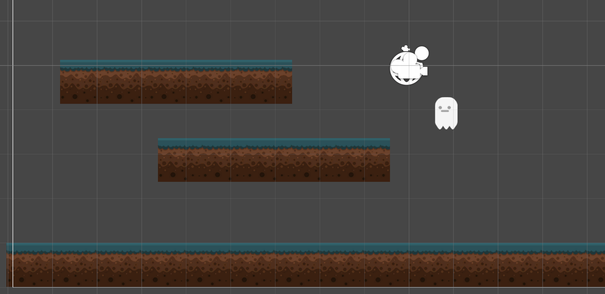

Would it work? Yeah, but we can do better. Especially since we have the art for it. In my Sprites > Graveyard folder, I'm 
going to add in Tiles 14, 15, and 16.

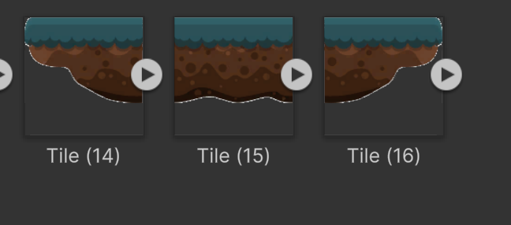

Notice how they go together to make a nice floating platform with even proper side ends. I'm going to change the names
to be PlatLeft, PlatCenter, and PlatRight.

For left and right, I'm going to change the import settings to:

* Sprite Mode - Single
* Pixels Per Unit - 128
* Mesh Type - Full Rect

For center, all the same settings as above, but with additional change of settings Wrap Mode to Repeat.

After dragging them into the scene and changing center's draw mode to be Tiled, I can do this:

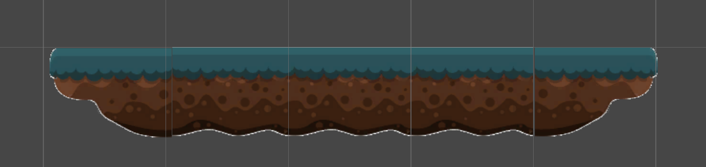

This is fine and all, but currently I have to make sure the ends line up correctly. And what if I decide that I want
to make a change to the width? It sounds like another opportunity to write another editor script to help us out.

Let's think it through first:
* I want three sprites to be treated as one sprite
* When I scale the platform, I only want the center-piece to change, while the end pieces just stay on each end.

Let's start by:
* Renaming PlatformCenter to Platform
* Place the left and right sections of the platform inside the platform object
* Create a new script named PlatformScaling
* Add it to the platform object

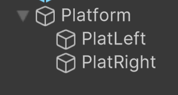

To make things easier, let's set the platforms to be at their default size and position. 
Remember that coordinates for children are relative to their parent's, so we can make:
* PlatLeft Position: -1, 0, 0
* PlatRight Position: 1, 0, 0

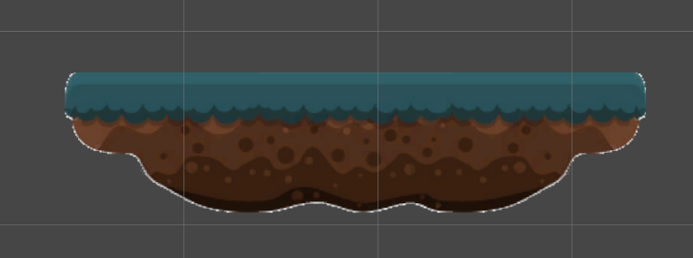

Open the script. First we want to set it up so that we can get the needed references and use the script in the editor:

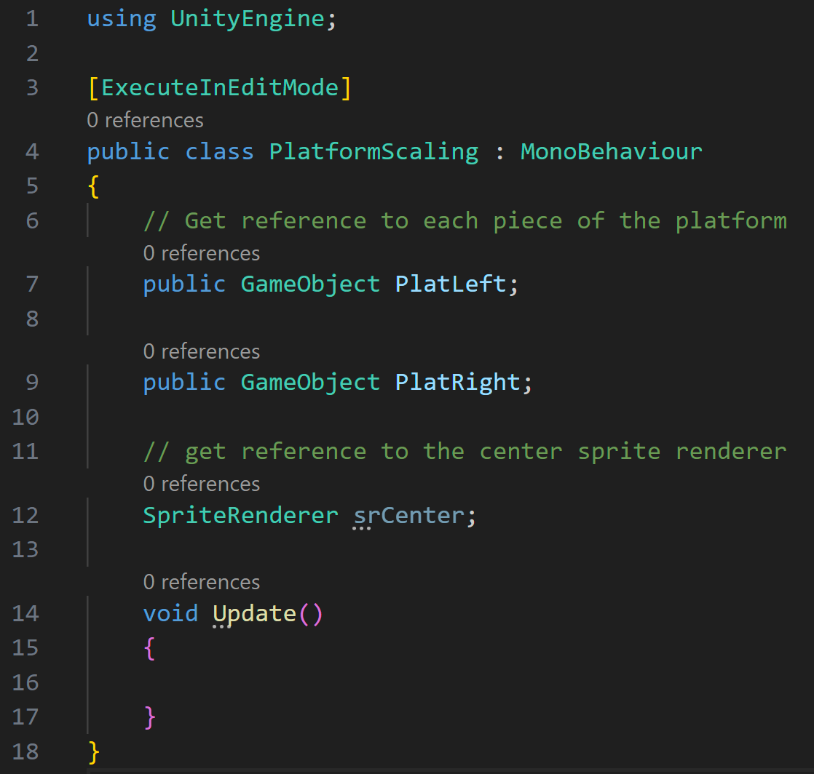

Then the first thing we want to do, is set the reference of the center sprite renderer:

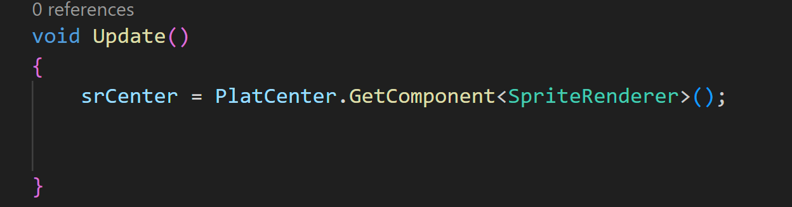

Next we want to get the width of the Platform object to determine what position the end sections should be:

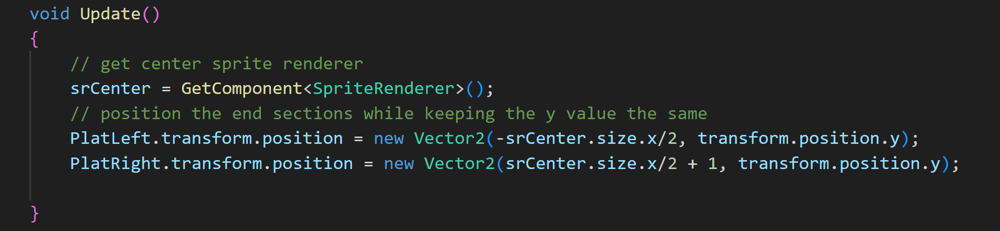

To finish it up, let's add in a way to resize the box collider and constrain the center size of y to be 1. That way we don't 
get a weird vertical tiling that would only happen for the center platform:

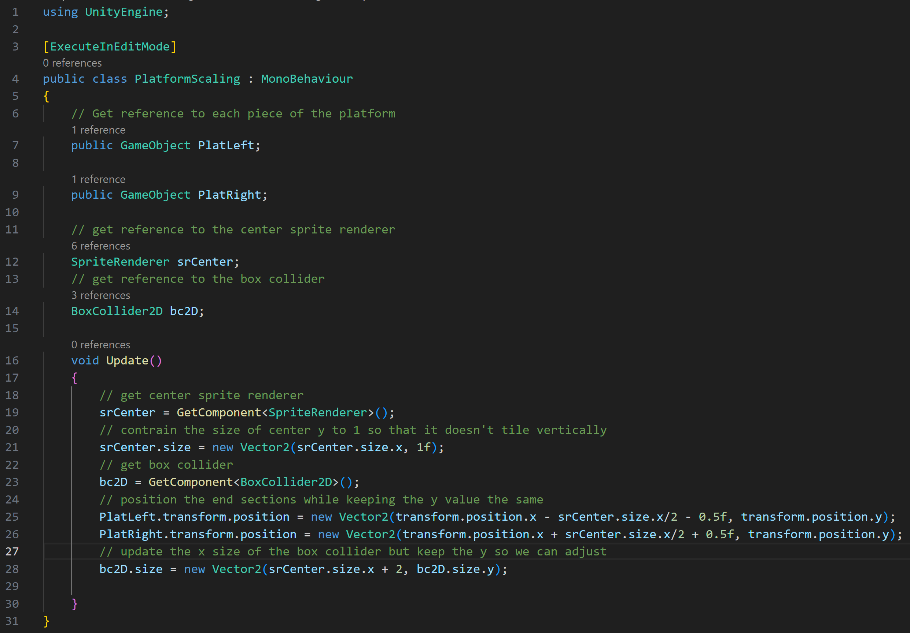

Now we can add a BoxCollider2D to the platform object and test out the resizing:

I'm also going to resize the box collider's Y size and Offset so it better lines up with where you expect it to be:

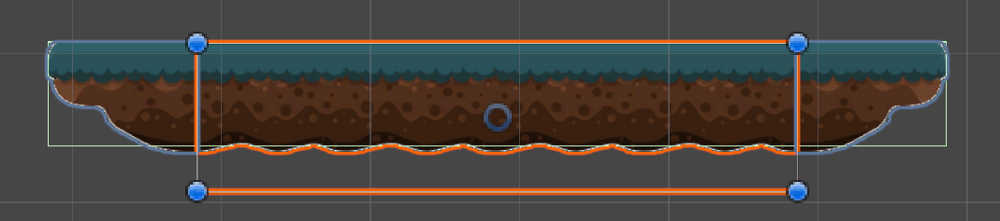

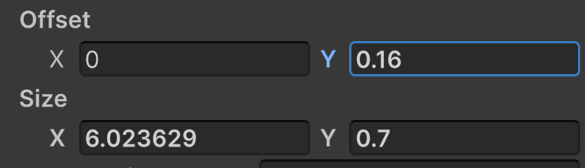

Since it's working, we can add the Ground tag and turn the Platform object into a prefab.

---
>Prev: [Adding Sprites](/03_Sprites/SPRITES.md) | Next: [Taking Damage](/05_Damage/DAMAGE.md)
