# Taking Damage
---
Often in platformers, there's a damage system for the player. Depending on the difficulty of the game, the player 
can take one or multiple hits before losing the level. I'm going to make it so the player can take a few hits before
having to restart.

Here we'll go through:
* Setting up an obstacle that will damage the player
* Getting the Game Manager up and going
* Show the player has taken damage
* Implementing a GUI so the player knows how many more hits they can take

## Dangerous Obstacles
---
In the Sprites folder:
* Create a folder named Obstacles
* Place the spikes.png in the folder

Then:
* Add spikes to the scene
* Add a BoxCollider2D to the spikes object
* Create and assign the tag of Obstacle to the spikes object
* Make the object into a prefab named Spikes

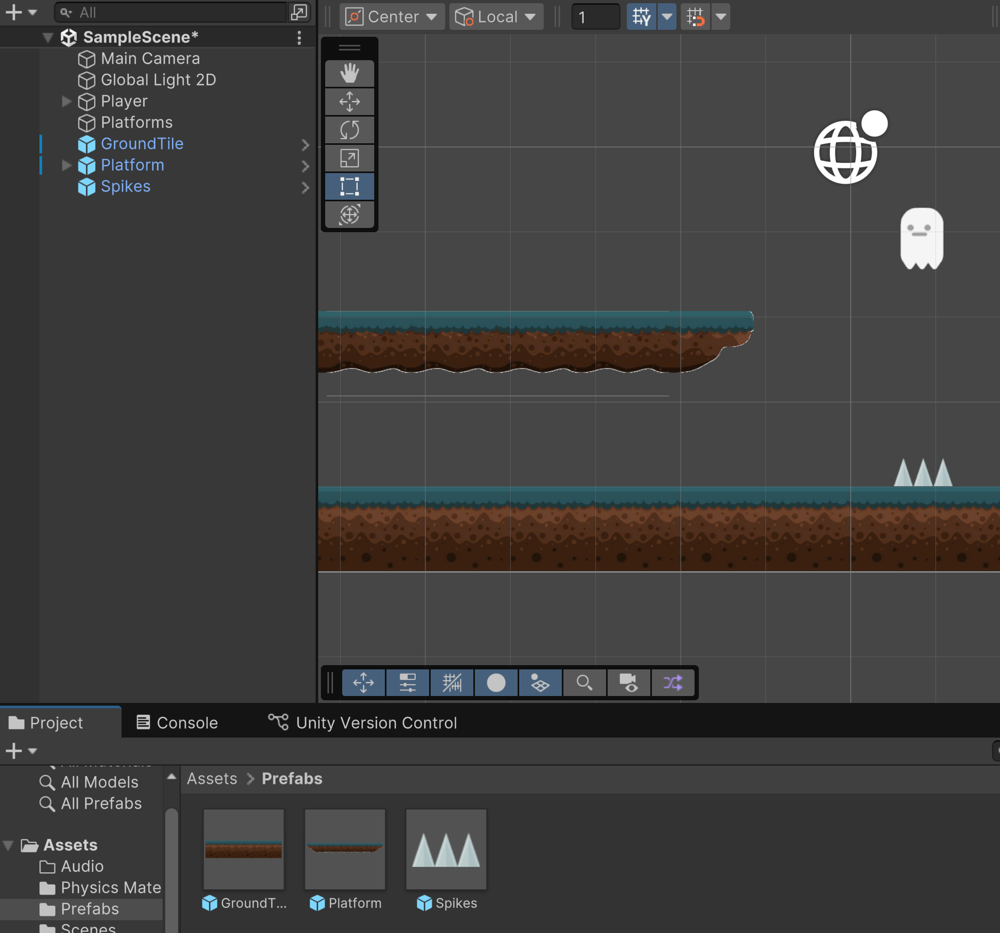

## Player
---
Now let's modify the player script so we know when we hit an obstacle. Let's add this logic to the script:

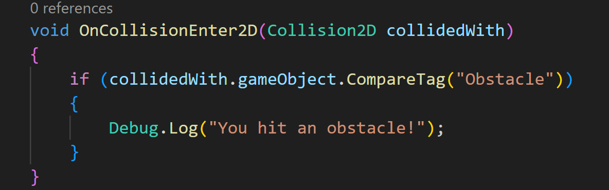

If we test it out, we can see it working through the debug log:

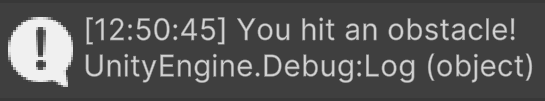

There are a couple of things that I would like to implement:

1. I want the player to be pushed back when they hit an obstacle so they can't just stand there and take damage
2. I want the player sprite to change to have a visual feedback
3. Set up an event that a game manager can listen for

First, in global space, let's set up a delegate and event to trigger when the player takes damage:

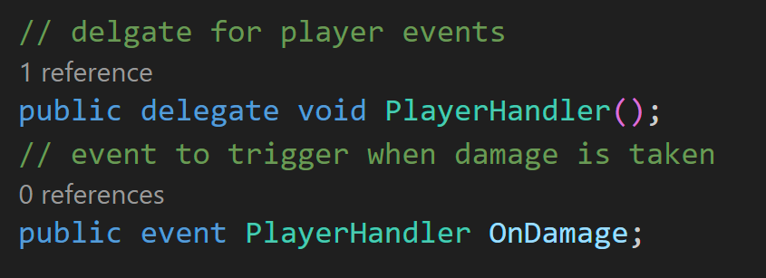

Now let's create a new function called DamagePlayer and call it when we hit an obstacle:

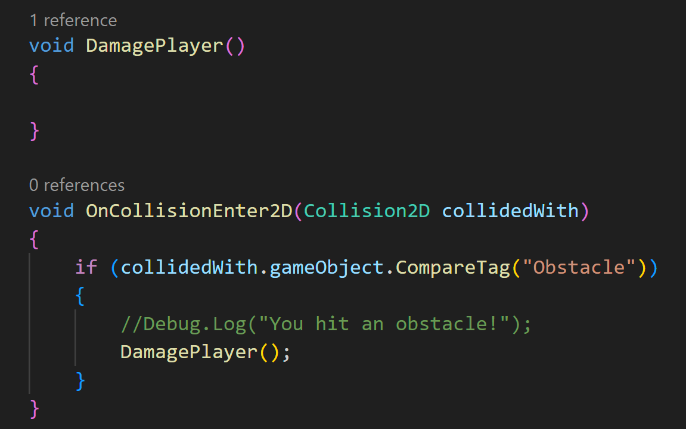

To force the player to be pushed back and up when hitting an obstacle, I can use the rigidbody's built-in AddForce function. 
Since I also want this to happen immediately at full force, I'm going to specify that I want the force mode to be set to impulse.

>[!NOTE]
> You can read more on the AddForce function [here in Unity's API](https://docs.unity3d.com/6000.0/Documentation/ScriptReference/Rigidbody2D.AddForce.html).

Since I know that I want the player to be push back and up but I don't know by how much, I'm going to make some global variables so that I can
tune the values in the editor:

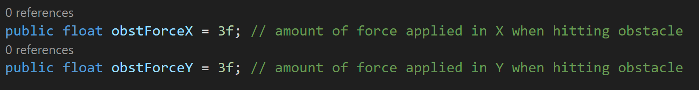

Back in DamagePlayer():

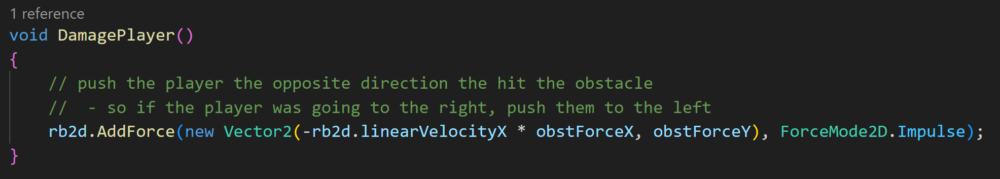

Testing it out in the editor, I can see that it's doing what I want for the most part. I can always dial it in later:

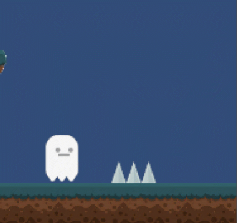

Back in the player script, I want to change the sprite when the player takes damage. I'm going to use the sprite named Ghost that's already in the player folder.
To keep things simple, I'm going to create some public reference to the sprites I want to use:

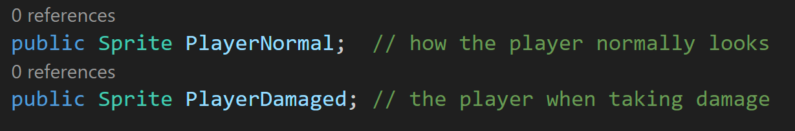

Also, I want to make a boolean to keep track of when the player should be damaged or not:

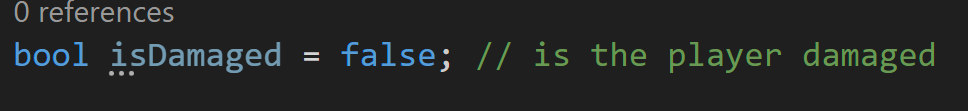

Now in DamagePlayer, I want to set the boolean to true, trigger the event we made earlier, and swap the sprite:

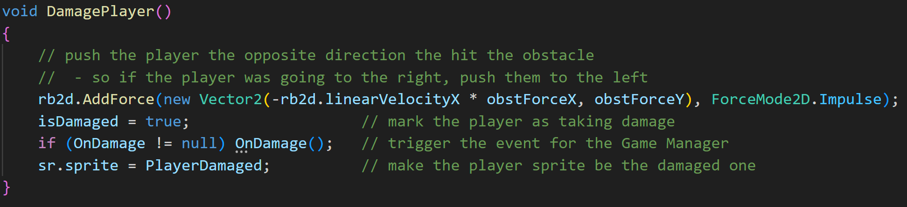

I'm thinking I want the sprite to go back to normal once the player touches the ground again, so I'll swap back in Update like this:

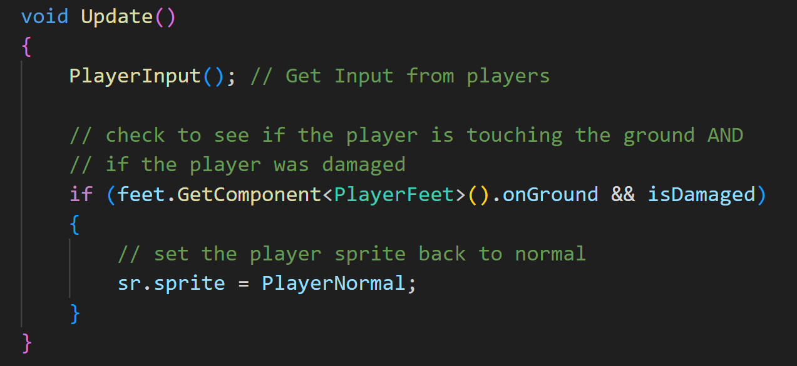

If we save the script, assign the references for the sprites, and test it out we can see:

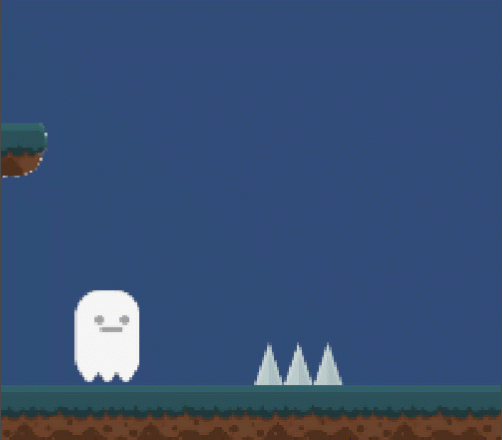

Next we want to set up the Game Manager and GUI

---
>Prev: [Platforms](/04_Platforms/PLATFORMS.md) | Next: [Game Manager and UI](/06_Manager/GMUI.md)
