# Game Manager and UI System
---
Let's set up the UI to display a basic health system using sprites:
* In the Sprites folder, create a new folder named UI
* Add the sprites for the empty, half-full, and full hearts.
* Create a UI > Image Object
* Assign the full heart to be the sprite for the image
* Rename the Image object to Heart1
* Create an empty object inside the Canvas object, and rename it to Health
* Place Heart1 inside of Health

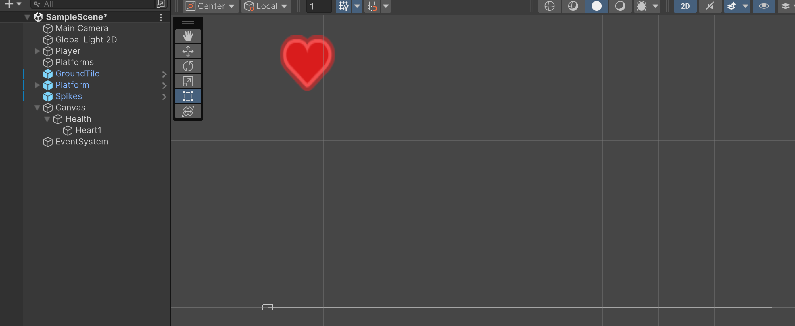

I don't like the size of the heart. I feel it should be smaller. With Heart1 selected, you can see the image size at the
bottom compared to the current width and height that it's set to. I end up deciding that I like half that size:

>[!TIP]
> When entering values, you can actually do math in the entry box. Say I know I want the width to be half of 53 but
> I don't want to do the math, I can enter 53/2 and Unity will calculate it for me.

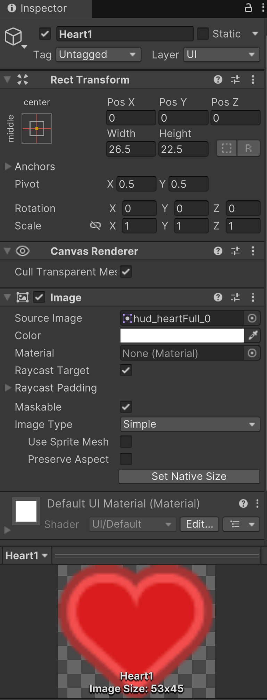

Currently, I'm thinking I want a three heart system. 
1. I want to make the Health object wide enough to hold three hearts
    * Since each heart is around 27px, I can change the width to be 27*3, which is 81
    * I decided to add a little padding and make 85
2. Position Heart1 to be -27, 0
3. Duplicate Heart1 and rename to Heart2
4. Position Heart1 to be 0, 0
5. Create Heart3 and position to 27, 0
6. You could also change the height of the Health object to something like 30

You should end up with something like this:

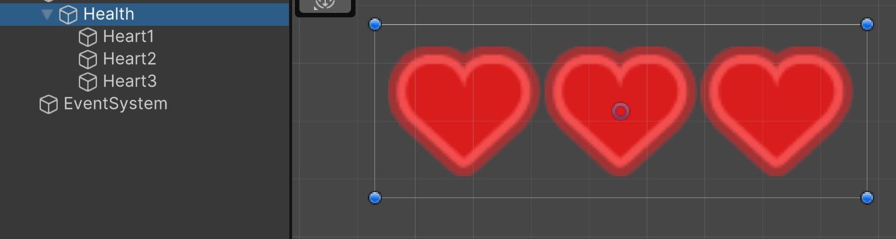

Now we want to place the Health container in the top-left of the screen. To help with this we can change the anchor point of the object.

Click on the thing that looks like a cross-hair (the thing with the two red lines and yellow center), and from the dropdown choose the
top left option:

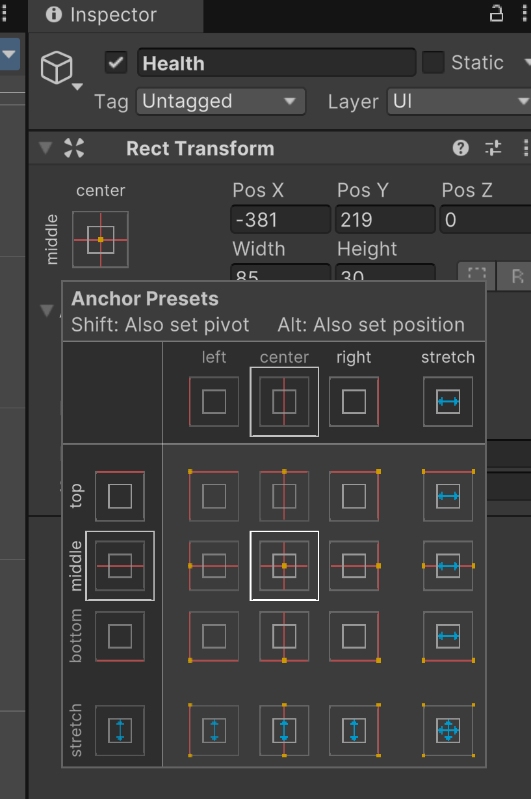

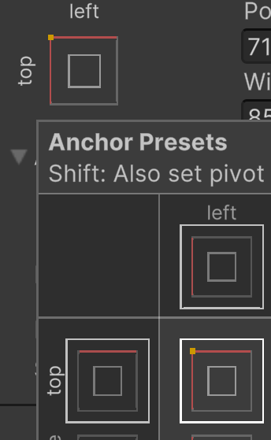

You might notice this white X move to the top-left. That's a visual indicator where the anchor point is for the UI object
that you have currently selected:

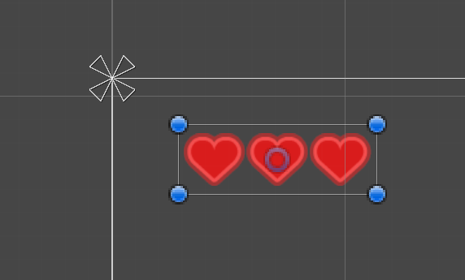

Now if you move the Health object, you'll see that its X and Y position is relative to the top-left corner, its anchor:

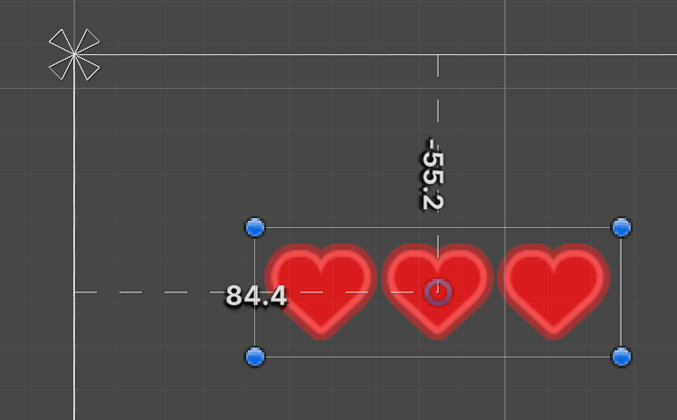

For now, I'm going to set the position to 80, -50, and adjust later if needed. Looking at it in game view, it seems to 
be okay:

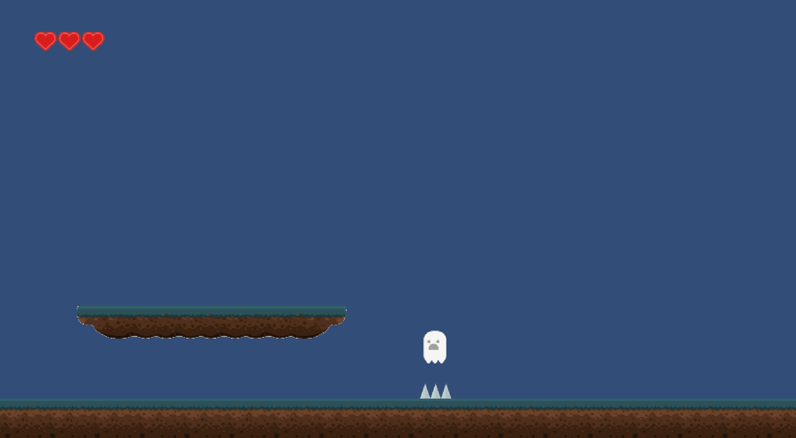

## Game Manager
---
1. Create and empty object
2. Rename it to GameManager
3. Create a new script named GameManager
4. Attach the script to the object
5. Open the script

For the GameManager script, I want it to:
* Reference the player
* Keep track of player's health
* Update the GUI to match that value

For the GUI, I need to reference each Heart object along with each heart sprite. I'm going also create a variable to 
keep track of the player's health total, and create a function that will be called when the player event is triggered.
This currently makes the script look like this:

>[!CAUTION]
> Below you will be creating references to the UI Image objects that we made to display the hearts. When you type in
> _Image_, you will see multiple entries:
> 
> 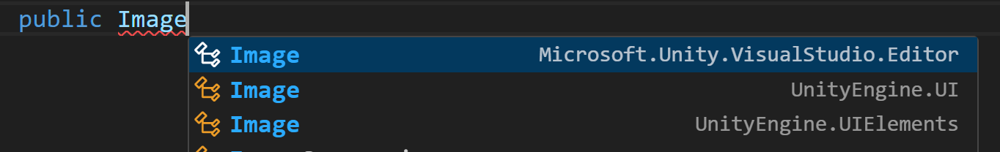
> 
> If you look to the right you will see which Image is associated with what. You want the one that's UnityEngine.UI. 
> If you don't choose, the first option will be chosen for you. This will NOT work.
> 
> You can tell which option you selected by looking at the top of the script. When you make reference to a class that's
> not currently included in the script, it will be added automatically for you with _using_ keyword.
> 
> If you don't select anything or choose the first option, you'll see:
> 
> 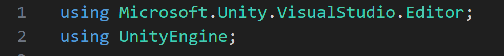
> 
> Again, this wrong and won't work. What you want is:
> 
> 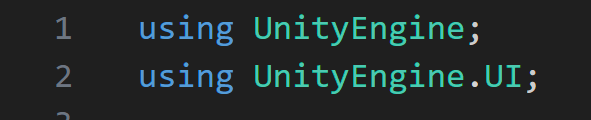
> 
> You only have to make sure you do this once in the script. It will know to use _UnityEngine.UI_ after it's set.
> 

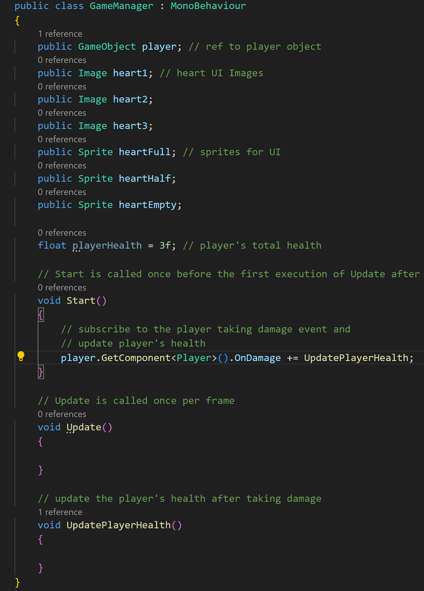

In the UpdatePlayerHealth function, I want to take away from the player's total health and update the UI. I'm 
choosing to implement a half-heart system, so the player can take 6 hits total. We can set this up using an if-else-if chain
so that we only run each statement as needed (Alternatively, you can also use a switch statement):

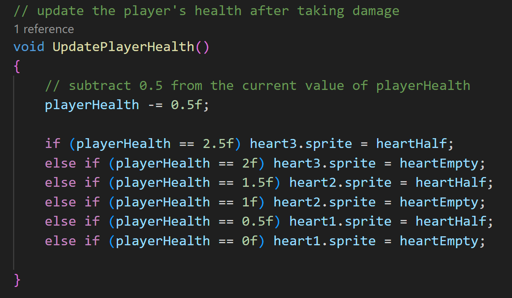

>[!NOTE]
> If you're curious or unfamiliar with switch statements, it would look like this:
> 
> 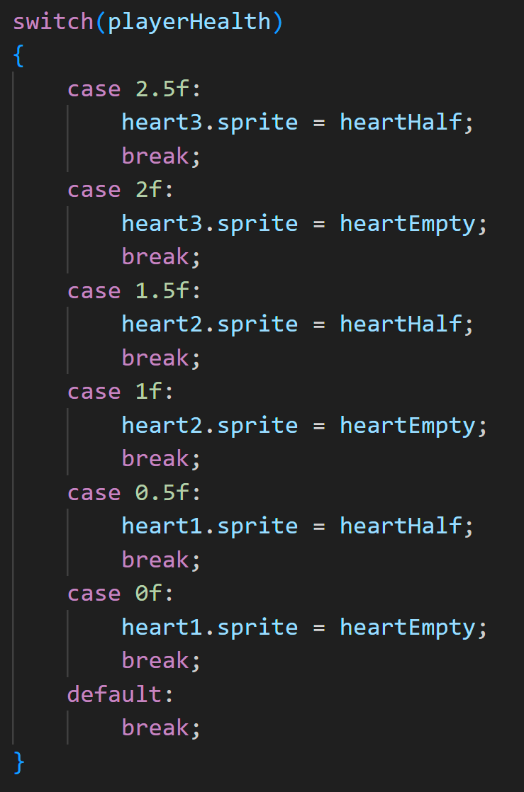
> 
> Switch statements work the same as if-else-if chains, but tend to be more performant and often more legible to the coder.
> This is more just for knowledge, as for our case, there isn't a reason to choose one over the other, other than personal preference.

Save, fill in the references, and test it out:

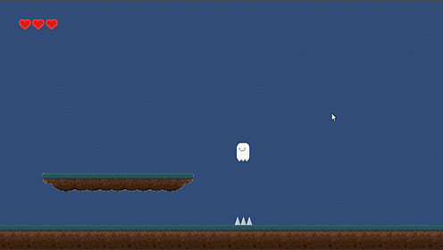

---
>Prev: [Taking Damage](/05_Damage/DAMAGE.md) | Next: [Enemies](/07_Enemies/ENEMIES.md)
