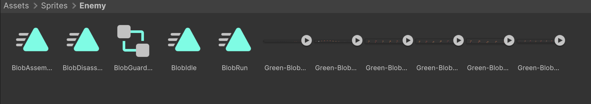
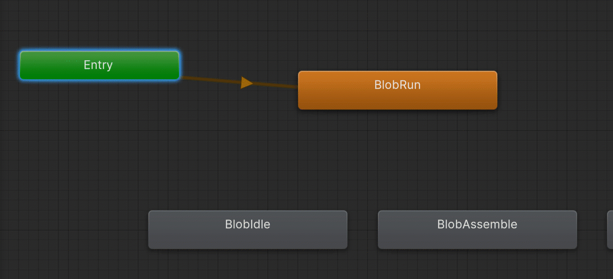
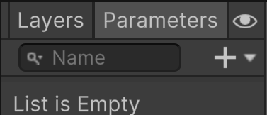
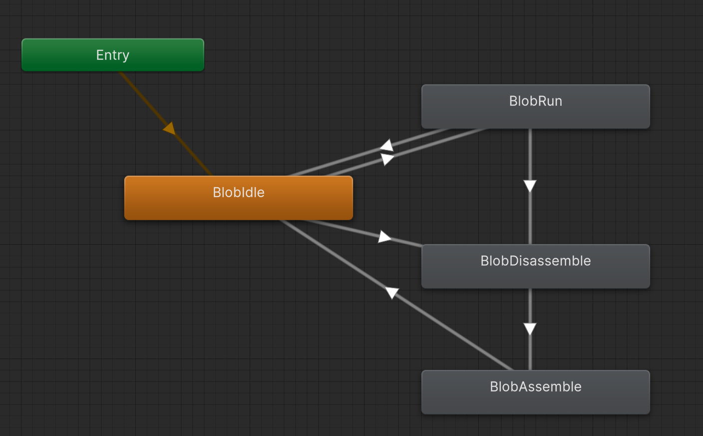
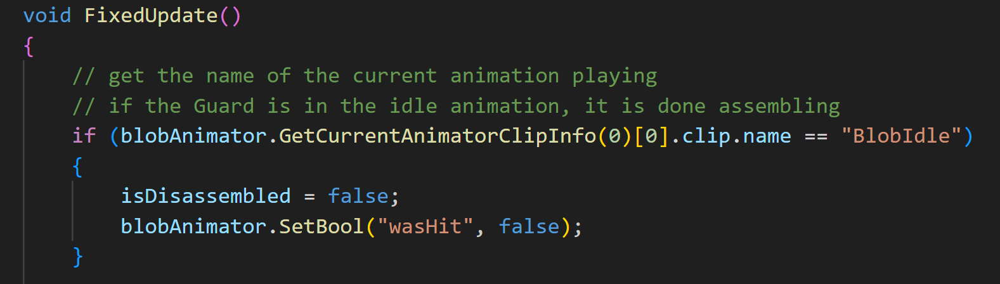
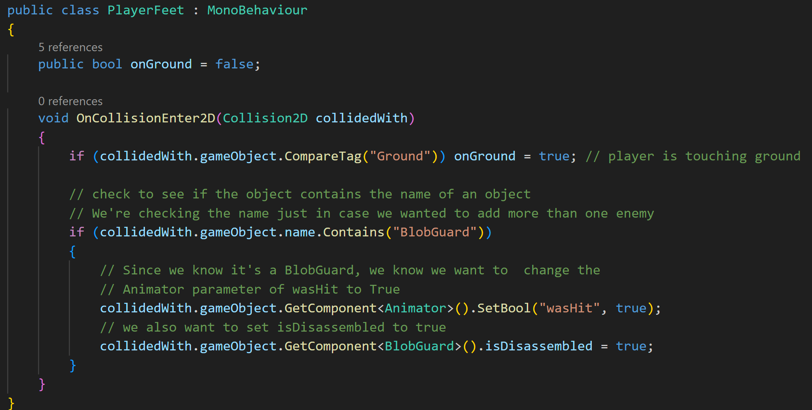
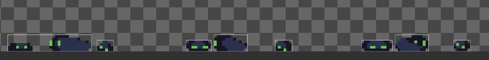

Part of the story in my head is that the ghost wakes up in a graveyard but doesn't know who they are. The ghost understands
that it's dead, but doesn't know what happened. It decides to leave the graveyard in search for answers. Unknown to the ghost, 
this isn't the first time a spirit has tried to leave the graveyard, so there are guards and obstacles set up to stop spirits from leaving.

The guards patrol.

* Create a sprite folder named Enemy
* Place all the blob files in there

You may notice that these sprites look different from the other sprites we've used so far. If you click on the arrow icon beside
one of the sprites, you'll see it expand. Then you can see each frame of the sprite. 

This is how you can create sprite animations.
We can also create animations with only single sprites, but often it's better to keep all the artwork associated with a particular
animation grouped together in a sprite sheet.

Unity is also automatically doing some work for us. To see things better, let's add the Sprite Editor to our layout.

From the top bar, select: Window > 2D > Sprite Editor

Click on the Sprite Editor tab, and then drag and drop it beside the Game tab:

If you click on one of the blob sprites, you'll see that Unity has gone in and found each frame in the sprite sheet, and 
named each frame with a unique name:

If you drag and drop one of the blob animations into the scene view, you'll get a window to create and name a new animation:

We'll talk about animations properly in a bit. For now, just click the save button. Again, we'll go into more detail in a moment, 
but you'll also see that an Animator Controller and an animation was created and placed in folder:

To make the artwork easier to see, I'm going to change the scale of the object that was created to be 4, 4:

If you run the game, you'll see the sprite animating:

That's nice, but the main thing I want to talk about is the quality of the artwork. Compared to the other sprite assets, it looks
blurry and washed out. This is because of the default settings Unity applies to sprites when you add them to the project.

>[!NOTE]
> By default, Unity is trying to optimize our sprites to make the final game as small as possible in size. This is usually
> a good thing, especially with 3D games, but if you're using any pixel style artwork, it looks bad.

To make our pixel art look better:
* First select one of the blob sprites in the folder.
* In the Inspector panel at the bottom, note that the height is 32px.
* Now, select all the blob sprites in the folder. 
  * This way we can apply all the same settings at once instead of doing this for each sprite individually.
* Change Pixels Per Unit to match the pixel height: 32
* Mesh Type: Full Rect
* Change the filter mode to: Point (no filter)
  * The other methods cause the blurring to make sprites look better. This is great for sprites with a lot of pixels, but bad for pixel art style sprites.
* Below that you'll see a setting called Compression. Change that to: None
  * Again, good for large files, but these files are already small. This keeps us from losing any of the little amount of data we have.
* Click Apply.

The blob sprite in the scene got bigger, so I'm going to scale it down to 2,2, but you can see how much better it looks:

## Enemy Setup
---
Okay now that looks are sorted out, let's look at how we can set up an enemy:
1. I'm going to delete the blob game object in the Hierarchy and the animation and animator controller in the folder.
   * This is to make sure we all start the same.
2. Now, I'm going to drag and drop the Green-Blob-Run sprite into the scene.
3. When creating the animation, I'm going to name it BlobRun.
4. Now, I'm going to rename the Green-Blob-Run_0 object to be BlobGuard (cause that's what they are in my narrative)
5. Create and apply a new tag named Enemy
6. I'm also going to go ahead and rename the Animator Controller in the Enemy folder to BlobGuardController
7. Change the scale of BlobGuard to 2,2
8. In the Sprite Renderer, change Draw Mode to Sliced
9. Attach a BoxCollider2D and a RigidBody2D component
10. Freeze Z rotation on the Rigidbody2D
11. Create and attach a new script named BlobGuard
12. Open the script

### BlobGuard AI

I don't want to make some super complicated AI. I want the Guard to act like a classic platformer enemy:
start in a location > walk forward a set amount > turn around and go back to the starting point.

We'll start by setting up some globals:

I'm just guessing how fast I want the guard to move. Also, I'm thinking each guard might have a different distance to walk,
so I made both of those variables public. I want the starting position to just be wherever I place it in the level, so we can
set the other two variables in Start():

Since I'm going to use physics to update the location, I'm going to change Update() to FixedUpdate() and add:

If you test it out:

Obviously, we want to flip the sprite's direction when it walks back, but first let's look into how we can set up other animations.

Looking at the available animations, aside from run, I only want to add assemble, disassemble, and idle.

For those three:
* Drag and drop each into the scene
* Name each animation appropriately (BlobIdle, BlobAssemble, BlobDisassemble)
* Delete the objects that get created in the Hierarchy
* Delete the Animator Controllers that get created for each new animation
  * The ones that are Green-Blob.... Not the one we renamed to BlobGuardController 
* For BlobAssemble and BlobDisassemble, select them. Then in the inspector panel uncheck the Loop Time option.
  * This is because we don't want these animations to loop.

When complete, your folder should look like this:

Now double-click on the BlobGuardController. This will open the Animator tab. This is how we can add and control the flow between different
animations for the Guard. Since we created the controller using the Run animation, Unity made the default animation BlobRun.

>[!TIP]
> You can think of the green Entry node like the Start() function. As soon as the game starts, the animation attached to Entry begins.

Here's the flow I would like to set up:
* On start, have the Guard idle
* Once the guard is moving, switch to the Run animation
* If the player jumps on top of the Guard, I want it to disassemble
* After a period of time, I then want the Guard to reassemble
* Then resume its walking

I'm going to drag and drop each animation we created to the Animator's Base Layer (the grid we're looking at):

Now I want to change the Entry animation to be the idle animation.

* Right-click on Entry
* Click Set StateMachine Default State
* Click on the Idle animation

Let's make a transition from Idle to Run:

* Right-click on Idle
* Click Make Transition
* Click on Run

Now I want to set up some logic that if the Guard is moving, I want to play the Run animation. To do this, we need to create
a parameter. At the top-left of the Animator tab, you'll see a button named Parameters.

After you click on it, the left side of the Animator tab with display our Parameters instead of listing out the Animator layers.

* Click the + icon to add a new parameter. 
* What we want is just a bool.
* Name the parameter to isMoving

>[!TIP]
>For a boolean, the checkbox indicates its default state, so if we wanted it to start out true, we could check that. But we want it false, so it's fine.

Now we want to set up a transition condition:
* Click on the arrow of the transition line from idle to run.
  * The line should turn blue.

You should see this in the Inspector panel:

Towards the bottom, you should see a list of conditions, which is currently empty.

Since we currently only have one condition, when you click the + button you'll get the condition we want:

So this means if the parameter isMoving is true, then the Guard will transition from the idle animation to the run animation.
This is great, but what if the Guard stops moving? It will always be stuck in the run animation. We need to set up a transition from run
back to idle.

* Right-click on Run
* Click Make Transition
* Click on Idle
* Select the transition line going from Run to Idle
* Add the condition when isMoving equals false

Now I want to set up a transition from Idle to Disassemble, and I want that transition to happen based on a new boolean
parameter named wasHit. Since I want to make it so that the Guard can also disassemble if it's hit while running, I want to set up 
a transition from Run to Disassemble using the same wasHit parameter.

From Disassemble, I want the guard to Assemble. Add the transition. Then let's look at the transition settings:

These are the settings that Unity uses for blending animations. I want to set it up so that if the player jumps on the guard, 
the guard falls apart and does nothing for a bit. After time has passed, I want the guard to assemble.

* Exit Time will control the amount of time to start switching from the Disassemble animation
* Transition duration will control the amount of time into the Assemble animation to start playing

* For Transition Duration I want that to be 0. I want to see the complete animation, no blending.
* An Exit Time of 1 makes the Assemble animation start immediately after Disassemble is complete. Looking at the timeline and entering a value of 2, I can see that gives me a little more than 3 seconds before the Assemble animation starts

Now I want to go from Assemble back to Idle.

Back in the BlobGuard script I want to reference the animator to change animations, the sprite renderer so we can flip the sprite,
 and the box collider because I want to disable collision while the guard is disassembled. I also want to keep track of if the guard 
is currently disassembled or not:

In FixedUpdate, I don't want the Guard to move if it's disassembled, so I'm going to put all the movement code inside an if
statement that checks for that:

In the above code, you'll see that we now flip the direction of the sprite accordingly. Also, you'll see how we can set
the values of the Animator's parameters. Depending on the parameter type, each has an associated Set method (SetFloat, SetInt, etc.).
You have to manually provide the name of the parameter, followed by the value you want to set it to.

Once we set isDisassembled to true, the Guard will no longer move, so we need to set it back to false (ideally once the assemble animation is complete).
In the Animator, we made it so that once the assemble animation completed, it moved into the idle animation, so if the guard is in the
Idle animation, we know that the assemble animation should be complete. We can determine this by getting the current animation playing.

>[!WARNING]
> The method of getting the name of the current animation playing is overly convoluted. 
> * The Animator object has a function we can use called GetCurrentAnimatorClipInfo(). 
>   * It requires an integer parameter that relates to the layer in the animator. Since, we are only using the default base layer, we enter 0. 
> * It then returns an array, where we want element 0, [0]. 
> * From there we can access the playing clip's name by using the .clip.name modifiers
> 
> For this example, it ends up being this to get the name:
> * blobAnimator.GetCurrentAnimatorClipInfo(0)[0].clip.name
> 
> If you want to read more on it, you can [check out here in the API](https://docs.unity3d.com/6000.0/Documentation/ScriptReference/Animator.GetCurrentAnimatorClipInfo.html).

We'll add this if-statement to the beginning of FixedUpdate():

To get the collision with the player's feet working, we actually need to modify things in the PlayerFeet script. This is because if we have
the guard check, it will only detect the Player, not Feet, because Feet is a child of the Player.

>[!NOTE]
> Moment of truth. I completely forgot about the Feet thing. I had to rewrite portions of this section to make it seem like all was good.

In the PlayerFeet script:

Now testing it out:

It works, but something is up with the animation.

If we click on the Disassemble sprite and look at it in the Sprite Editor, we can see that Unity has wrongly detected the sprites. It has turned what
should be one frame of animation into multiple frames:

This will depend on the sprites you use. Usually, it'll probably be fine, but since this animation has multiple parts seperated per frame, 
it's messing with Unity's detection system. But we can fix it, which unfortunately also means we need to redo a lot.

>[!TIP]
> If you're just following along to learn and plan on using your own sprites, don't worry about completing the next steps.
> Just know that you may need to do the same, depending on the sprites you use.

* In the Enemy folder, delete all the animations. We need to remake them.
* Select one of the sprites and look at it in the Sprite Editor

The issue is that Unity is automatically slicing the sprite sheet for us. We need to do it manually. Right under the Sprite Editor tab is a button
named Slice. Click on it. In the dropdown, choose Grid By Cell Size for the Type:

Since these sprites are 32px high, input a value of 32 for Y in Pixel Size. You should see a red grid now:

It turns out these work as being 64 x 32, so you can click on the Slice button at the bottom of the dropdown.
You should see that all the little white boxes are gone.
Click the Apply button at the middle-top-ish.

* Now do this for each spritesheet.
* Once complete, drag each spritesheet into the scene to create the animations. Name each one as they were before.
* Delete the new Animator Controllers
* Open the BlobGuardController.
* Delete all the animation states.
* Drag in the "new" animations and set up the transitions and logic as we did previously.

For the BlobGuard object:
* I made the Idle sprite sheet the Sprite in the Sprite Renderer.
* Set Draw Mode to Simple
* Also set the transition time to 0 for the transitions into Disassemble to make it happen as soon as the player hits the Guard.

After all that, it was kind of worth it:

Some Tweaks
I want to make it so that the player can't collide with the Guard when disassembled. I also want to make it so that if
player touches the Guard, other than with the feet, they take damage.

For the first part, I'm just going to disable and enable the rigidbody on the Guard. I'll disable it of the Guard is disassembled.
I can do this by adding an else statement onto my if(!isDisassembled):

Then enable it when the Guard reaches the idle animation

The next one is easy too. In the player script where we check for collision, we can make the if statement also call the DamagePlayer function.
Instead of adding another if statement, which you could, we can make the logic true if the game tag is Obstacle OR Enemy.

>[!TIP]
> For if statements, we've used the AND operator (&&) to check for two things to be true. We can also use the OR operator (||) to check if either given
> option is true.

---
>Prev: [Game Manager and UI](06_Manager%2FGMUI.md)  | Next: [Background](08_Background%2FBG.md)
