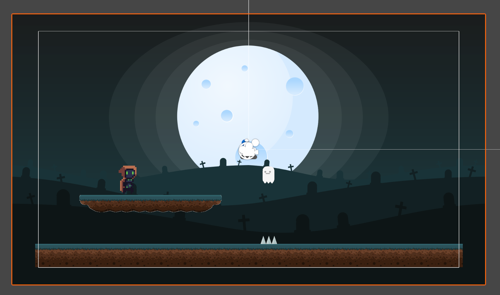
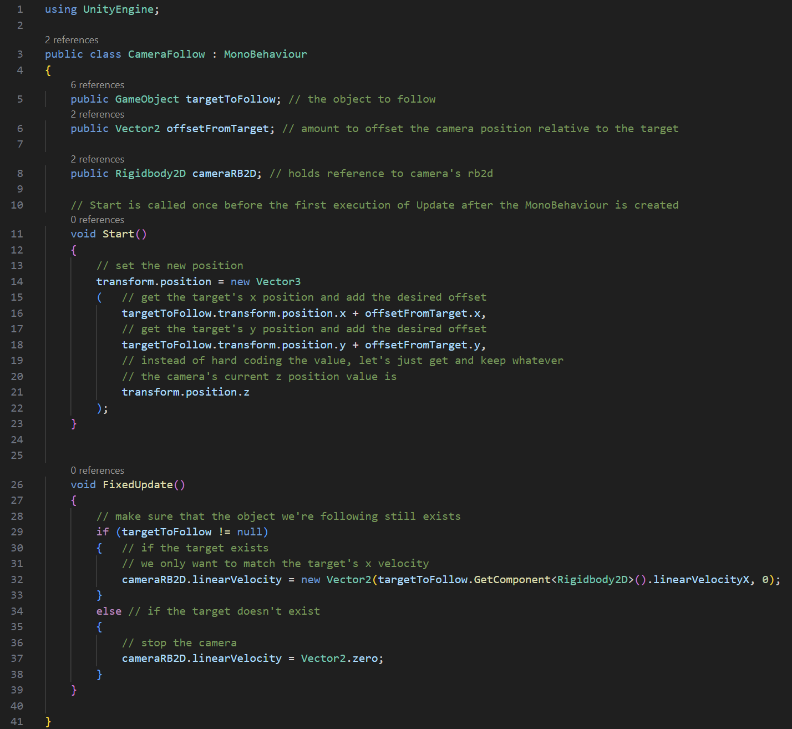
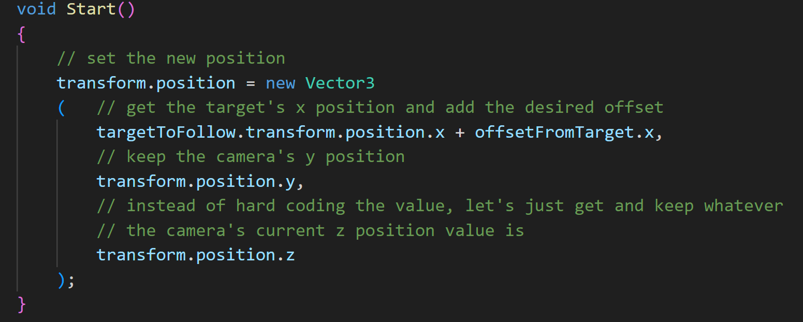
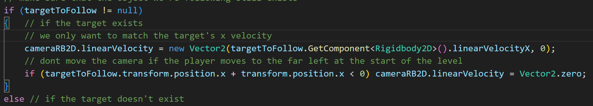

# Add A Background
---

* Add the BG sprite to the Sprites > Graveyard > Backgrounds folder
* Drag and drop to the scene.
* Make it's x and y position 0,0

* Make the BG object a child of the Main Camera
* Add a rigidbody 2d to the camera
  * Set Gravity Scale to 0 
* Create a new script named CameraFollow
* Attach it to the camera

For the script, we're going to start off using the exact same one we made in the previous example:

Assign all the references.

Not perfect, but we are using the same logic from a different game type. Let's make it fit this project.

First, if this was the start of the level, I don't want the camera to continue left. For this platformer, I want
the camera to only travel along the X axis, so in Start():

Then in FixedUpdate(), I want to check if the player's x position plus the camera's x position is less than 0. If so, I 
don't want to move the camera. Basically, the camera will start at 0,0. If the player moves to the left of the screen it's 
X position will be negative.

That gives us this:

---
>Prev: [Enemies](/07_Enemies/ENEMIES.md) | Next: [Making A Level](/09_Level/LEVEL.md)
