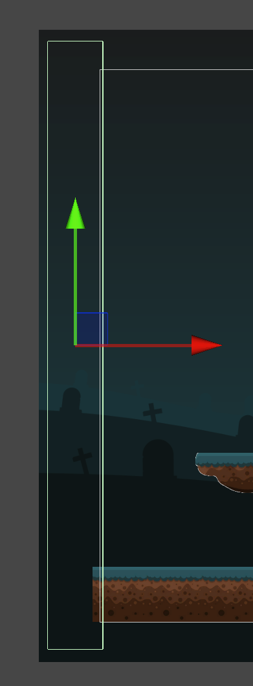
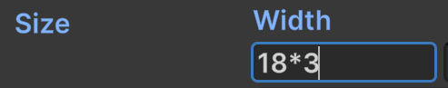
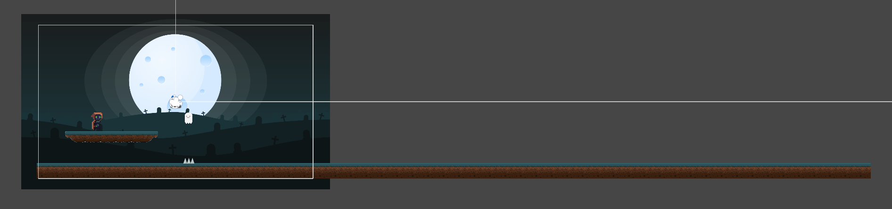
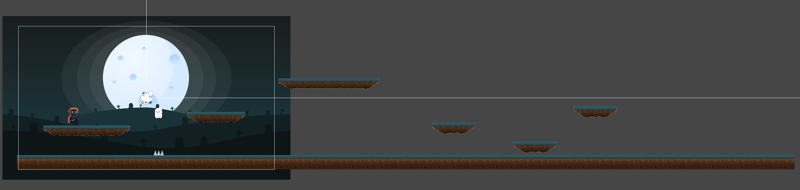
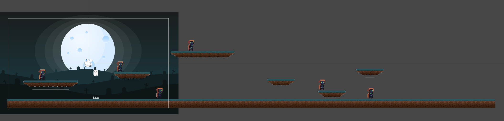
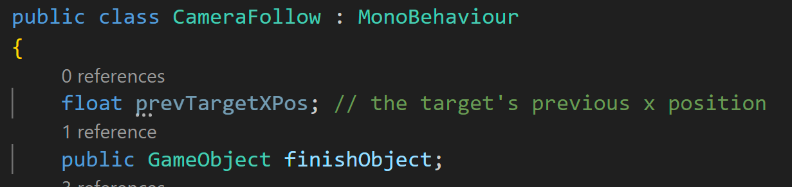
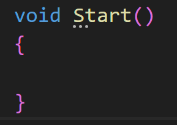
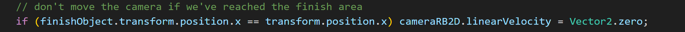
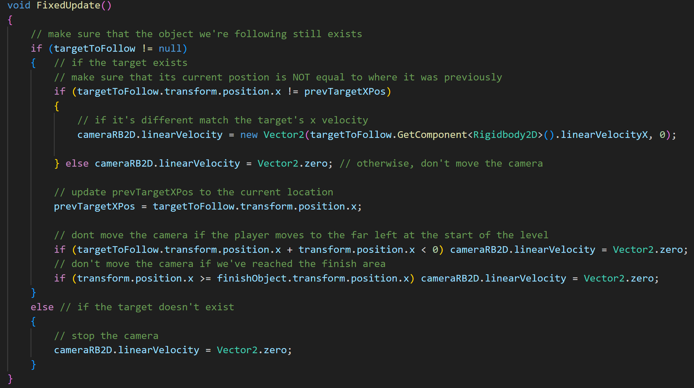

# Making A Level
---

Now we want to look at making the level longer. It's pretty easy, but we also want to set up a couple of things.

First I want to setup a starting barrier on the left side of the screen. This is just to make sure the player can't
walk to the left and fall off the ground forever.

* Create an empty and name it StartBarrier
* Add a BoxCollider2D
* Scale and place it just on the left side of the screen

* Duplicate StartBarrier
* Rename it to Finish
* Make the collider a trigger
* Create and add the tag Finish

* Extend the GroundTile object's width in its Sprite Renderer.
  * Currently, mine has a width of 18, and that seems to cover the length of my screen.
  * What I could do is multiply that width by 3 to give me a ground length of 3 screens

Position GroundTile so that the left side matches the left side of the screen.

Place the Platform object inside the empty Platforms object. Duplicate and place more platforms to the right.
Doesn't matter where at the moment:

* Turn the BlobGuard object into a prefab. 
* Create an empty named Guards
* Place the BlobGuard in Guards
* Duplicate and place more BlobGuards
* Depending on the placement, you may need to change the value of Dist To Walk on each BlobGuard

After testing it out, I realize we need to make some more tweaks to the camera script:

First I want to add a reference to the Finish object. This is because I want the camera to no longer move when we get near the end of the level.
I also want a private float to keep track of the target's previous x position (this will be explained in a bit):

Then in Start(), I want the camera to start off with its initial 0,0 position:

Yep, that's right. It can just be blank. Alternatively, you could just comment out everything just in case you wanted to implement 
any of the logic later on.

Next, I want to make it so that if the Camera's x position matches the x position of Finish, I want it to stop moving.

Finally, I don't want to move the camera if the target isn't moving. If the player gets stuck on something but continues to hold the direction key,
the player is still adding velocity, just not going anywhere, but this will still cause the camera to move. To fix this we just want to compare
where the player was previously to where the player is currently. If it's in the same spot, don't move the camera:

Save it, set the references, move the finish object near the end, and test it out:

---
>Prev: [Background](/08_Background/BG.md)
